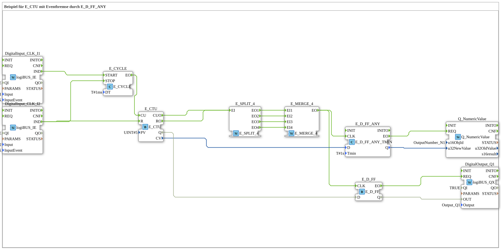

# Exercise_080e2: Example of E_CTU with Event Brake via E_D_FF_ANY

* * * * * * * * * *

## Introduction

This exercise demonstrates the use of an up counter (E_CTU) in combination with an **event brake**, implemented by the function block `E_D_FF_ANY_TMIN`. The counter is incremented via a cyclic event generator (E_CYCLE) as soon as a key is pressed at `DigitalInput_CLK_I1`. A second key press at `DigitalInput_CLK_I2` resets the counter and stops the cycle. The output counter values are only passed to a numeric output if the minimum dwell time (`Tmin`) of the signal state is exceeded – this prevents unwanted or noisy values. An additional D flip-flop block (`E_D_FF`) outputs the counter status (Q) as a binary signal to a digital output.

## Function Blocks Used

This exercise uses the following predefined function blocks in the network:

| Block Name | Type | Parameters | Short Description |
| -------------- | ----- | ----------- | ------------------ |
| `DigitalInput_CLK_I1` | `logiBUS::io::DI::logiBUS_IE` | `QI = TRUE`, `Input = Input_I1`, `InputEvent = BUTTON_SINGLE_CLICK` | Generates an event (`IND`) when a button is pressed on input I1. |
| `DigitalInput_CLK_I2` | `logiBUS::io::DI::logiBUS_IE` | `QI = TRUE`, `Input = Input_I2`, `InputEvent = BUTTON_SINGLE_CLICK` | Generates an event (`IND`) upon a single key press on input I2. |
| `E_CYCLE` | `iec61499::events::E_CYCLE` | `DT = T#1ms` | Cyclic event generator; generates an event (`EO`) every 1 ms after starting, until stopped. |
| `E_CTU` | `iec61499::events::E_CTU` | `PV = UINT#5` | Up counter: Increments with each event at `CU`; outputs the current count (`CV`) and an overflow signal (`Q`). Reset via `R`. |
| `E_SPLIT_4` | `iec61499::events::E_SPLIT_4` | – | Distributes an incoming event to four parallel outputs (`EO1` … `EO4`). |
| `E_MERGE_4` | `iec61499::events::E_MERGE_4` | – | Combines up to four input events (`EI1` … `EI4`) into a single output event (`EO`). |
| `E_D_FF_ANY` | `iec61499::events::E_D_FF_ANY_TMIN` | `Tmin = T#1s` | D flip-flop with minimum dwell time: Receives the data input `D` upon an event at `CLK`, outputs the state at `Q`, but only if the event persists for at least `Tmin`. |
| `E_D_FF` | `iec61499::events::E_D_FF` | – | Standard D flip-flop: Receives the data input `D` upon an event at `CLK` and outputs the state at `Q`. |
| `DigitalOutput_Q1` | `logiBUS::io::DQ::logiBUS_QX` | `QI = TRUE`, `Output = Output_Q1` | Sets the digital output Q1 to the value of the input `OUT`. |
| `Q_NumericValue` | `isobus::UT::Q::Q_NumericValue` | `u16ObjId = OutputNumber_N1` | Outputs a numeric value (32-bit integer) to a visualization component (here: `OutputNumber_N1`). |

## Program Flow and Connections

### Event Connections

1. **Cycle Start**: Pressing a key on `DigitalInput_CLK_I1` triggers the event `IND`. This starts `E_CYCLE` (via `START`).
2. **Counter Clock**: `E_CYCLE` generates an event (`EO`) every 1 ms, which is directly connected to the counter input `CU` of `E_CTU`.
3. **Counter Evaluation**: The `E_CTU` outputs an event to `CUO` or `RO` on each increment (or overflow). Both events are split across four parallel paths via `E_SPLIT_4`.
4. **Combination**: All four outputs of `E_SPLIT_4` are combined into a single event in `E_MERGE_4`. This results in an event for every counter event (regardless of the cause).
5. **Event Brake (E_D_FF_ANY)**: The combined event is sent to the clock input `CLK` of `E_D_FF_ANY`. This output only receives the current counter value (`CV` of `E_CTU`) if the event remains stable for more than 1 second (minimum dwell time). The output signal `Q` of `E_D_FF_ANY` is forwarded to the numeric output `Q_NumericValue`.
6. **Digital Output (E_D_FF)**: In parallel, the same event is also fed to the normal output `E_D_FF`, which stores the binary overflow status (`Q` of `E_CTU`). The output `Q` of `E_D_FF` controls the digital output `DigitalOutput_Q1`.
7. **Stop and Reset**: Pressing a key on `DigitalInput_CLK_I2` generates an event that simultaneously stops the cycle (`E_CYCLE.STOP`) and resets the counter (`E_CTU.R`).

...

### Data Connections

- `E_CTU.CV` (Current Count Value) → `E_D_FF_ANY.D`
- `E_D_FF_ANY.Q` → `Q_NumericValue.u32NewValue` (Output of Filtered Count Value)
- `E_CTU.Q` (Overflow/Status) → `E_D_FF.D`
- `E_D_FF.Q` → `DigitalOutput_Q1.OUT` (Binary Output State)

### Exercise Notes

- **Learning Objectives**: Understanding the combination of upcounters, event flows, and time-delayed value acquisition (event braking). Typical application: Debouncing of count pulses or smoothing of measured values.
- **Difficulty Level**: Advanced – Knowledge of IEC 61499 event control and the use of `E_D_FF_ANY` is required.
- **Prerequisites**: Basic knowledge of function blocks, event connections, and the 4diac IDE workflow.
- **Starting the Exercise**: The SubApp object `Uebung_080e2` must be integrated into a 4diac project. The hardware inputs (I1, I2) and outputs (Q1, OutputNumber_N1) must be connected according to the logiBUS configuration.

## Summary

Exercise 080e2 illustrates how an event-driven counter is coupled with **temporal filtering** (event braking). The counter is started by a push button and stopped or reset by a second push button. The filtered counter value is displayed on a numeric display, while the binary overflow status triggers a digital output. The combination of `E_SPLIT_4`, `E_MERGE_4`, and `E_D_FF_ANY_TMIN` ensures that only stable measured values are displayed. This pattern is suitable for robust counter applications in automation technology.

---

### 🌐 Related topic subpages on ms-muc-docs.de

- [🌐 E_CTU Event Counter Block on ms-muc-docs.de](https://www.ms-muc-docs.de/iec-61499/event-function-blocks/e_ctu/)
- [🌐 Eclipse 4diac IDE & Color Reference on ms-muc-docs.de](https://www.ms-muc-docs.de/iec-61499/eclipse-4diac/)
- [🌐 IEC 61499 Events – The Pulse of Automation on ms-muc-docs.de](https://www.ms-muc-docs.de/iec-61499/events/event/)

]
