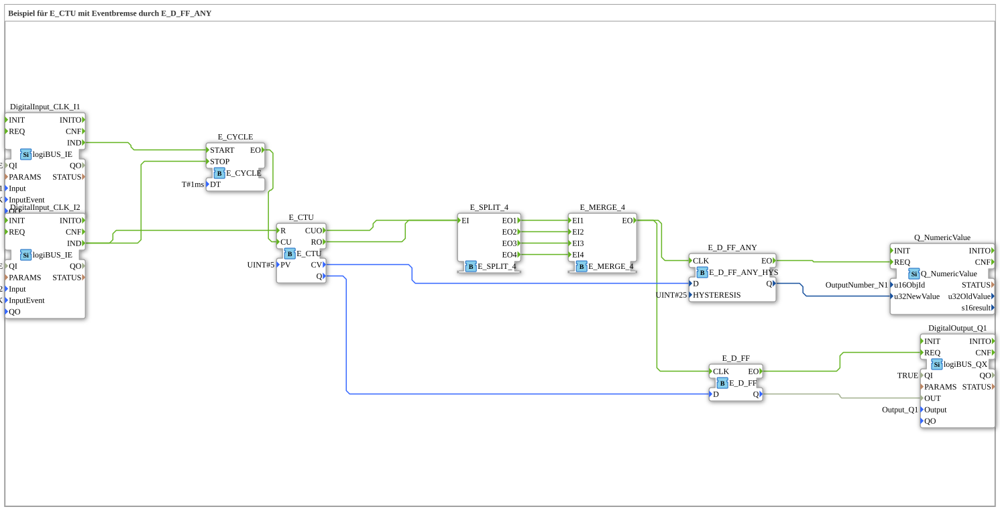

# Exercise_080e3: Example of E_CTU with Event Brake using E_D_FF_ANY

* * * * * * * * * *
## Introduction
This exercise demonstrates the use of the function block **E_CTU** (up counter with event control) in combination with an **event brake**, implemented using an **E_D_FF_ANY** (flip-flop with hysteresis). Through the interplay of cyclic counting pulses, manual reset, and hysteresis on the counter value, an output signal is only triggered when a specific counter value is reached and the hysteresis threshold is exceeded. The exercise illustrates the use of event logic (E_SPLIT, E_MERGE), controlling a digital output, and passing a numeric value to an output number.

``` ## Function Blocks Used

This exercise contains no further subapplications, but uses only basic function blocks from the libraries `logiBUS`, `iec61499`, and `isobus`. The most important function blocks are described below.

``` ### DigitalInput_CLK_I1 & DigitalInput_CLK_I2

- **Type**: `logiBUS::io::DI::logiBUS_IE`
- **Parameters**:
- `QI` = `TRUE`
- `Input` = `Input_I1` or `Input_I2`
- `InputEvent` = `BUTTON_SINGLE_CLICK`
- **Function**: Detects a key press (single click) on the physical inputs I1/I2 and outputs an event `IND` on each rising edge.

### DigitalOutput_Q1
- **Type**: `logiBUS::io::DQ::logiBUS_QX`
- **Parameters**:
- `QI` = `TRUE`
- `Output` = `Output_Q1`
- **Function**: Switches the digital output Q1 according to the incoming data signal `OUT`.

### E_CYCLE
- **Type**: `iec61499::events::E_CYCLE`
- **Parameters**:
- `DT` = `T#1ms` (period 1 ms)
- **Function**: After starting (event input `START`), generates an event at output `EO` at regular intervals of 1 ms. This can be stopped by the event `STOP`.

### E_CTU
- **Type**: `iec61499::events::E_CTU`
- **Parameters**:
- `PV` = `UINT#5` (Comparison value 5)
- **Function**: Up counter. The internal counter value is incremented with each event at input `CU`. The counter is reset to 0 at `R` (Reset). An event is output at event output `CUO` after each count pulse, and at output `RO` when the comparison value `PV` is reached (counter ≥ PV). The current counter value is available at data output `CV`, and the Boolean comparison status is available at output `Q`.

### E_SPLIT_4
- **Type**: `iec61499::events::E_SPLIT_4`
- **Function**: Distributes an incoming event (input `EI`) to four parallel outputs (`EO1`…`EO4`).

### E_MERGE_4
- **Type**: `iec61499::events::E_MERGE_4`
- **Function**: Combines up to four incoming events (`EI1`…`EI4`) into a single event output `EO` (OR operation).

### E_D_FF_ANY
- **Type**: `logiBUS::signalprocessing::hysteresis::E_D_FF_ANY_HYS`
- **Parameters**:
- `HYSTERESIS` = `UINT#25` (hysteresis width 25)
- **Function**: A flip-flop with hysteresis. Upon an event at the clock input `CLK`, the current data value `D` (unsigned integer) is adopted. The output value `Q` is only updated if the difference to the previous value exceeds the hysteresis. This prevents unwanted flickering during small changes. The event output `EO` signals a value change.

### E_D_FF
- **Type**: `iec61499::events::E_D_FF`
- **Function**: Standard D flip-flop. Upon each event at the clock input `CLK`, the data input `D` (boolean) is adopted and output `Q`. An event at output `EO` indicates the transfer.

### Q_NumericValue
- **Type**: `isobus::UT::Q::Q_NumericValue`
- **Parameters**:
- `u16ObjId` = `OutputNumber_N1`
- **Function**: Receives an unsigned integer value at data input `u32NewValue` and passes it to the system-wide defined output number `N1` upon an event at input `REQ` (e.g., for display on a panel).

## Program Flow and Connections

The exercise follows this sequence:

1. **Initialization**: Pressing a key on **I1** generates an event `IND` from the function block `DigitalInput_CLK_I1`. This starts the **E_CYCLE**, which now continuously generates an event at its output `EO` every 1 ms.

2. **Counting**: The periodic event from **E_CYCLE** is routed to the counter input `CU` of the **E_CTU**. The counter increments with each pulse. At each counting step, an event is output via output `CUO`, as well as when the counter reading reaches or exceeds the comparison value `PV` (5) (output `RO`).

3. **Event Multiplication and Merging**: Both event outputs of the counter (`CUO` and `RO`) are split into four parallel channels via an **E_SPLIT_4**. These four channels are then merged back into a single event stream via an **E_MERGE_4**. Thus, each counting pulse and each PV exceedance pulse generates exactly one event at the MERGE output.

3. **Event Multiplication and Merging**: 4. **Hysteresis-Controlled Flip-Flop**: This combined event is applied to the clock input `CLK` of the **E_D_FF_ANY**. The data input `D` receives the current counter value `CV` of the E_CTU. The **E_D_FF_ANY** only adopts this value if the value has changed by at least `HYSTERESIS` (25). Upon such a significant change, it outputs an event at `EO` and applies the smoothed value to `Q`.

The data input `D` receives the current counter value `CV` of the E_CTU. 5. **Value Output**: The event of **E_D_FF_ANY** is forwarded to input `REQ` of **Q_NumericValue**. This input takes the smoothed counter value (`u32NewValue`) from `E_D_FF_ANY.Q` and makes it available at output `N1` (e.g., for a numeric display).

6. **Parallel Digital Output**: The merged event from **E_MERGE_4** is also sent to the clock input `CLK` of a standard **E_D_FF**. The data input `D` receives the Boolean status `Q` of E_CTU ("counter ≥ PV"). Thus, with each counting pulse, the current comparison status is stored in the flip-flop and output at `Q`. An event at the flip-flop's output `EO` controls the **DigitalOutput_Q1**, which sets the Boolean value to the physical output Q1.

7. **Reset Function**: Pressing a button on **I2** (second input) generates an event `IND` of the **DigitalInput_CLK_I2**. This event is then sent to the reset input `R`.The E_CTU is connected to the `STOP` input of the E_CYCLE, thus halting the cyclical generation of clock pulses. This resets and stops the entire counting process.

## Summary

Exercise **Exercise_080e3** demonstrates a practical combination of an event-driven counter (**E_CTU**), hysteresis-based smoothing (**E_D_FF_ANY**), and a Boolean flip-flop (**E_D_FF**). Through the interaction of **E_CYCLE**, **E_SPLIT_4**, and **E_MERGE_4**, a robust event system is created that monitors the counter value with adjustable hysteresis and outputs both a digital output and a numerical value. A second button allows the counting process to be reset and stopped. This exercise teaches fundamental concepts of event-driven control engineering, in particular the use of event branches, merges, and the importance of hysteresis in signal processing.

---

### 🌐 Related topic subpages on ms-muc-docs.de
* [🌐 E_CTU Event Counter module on ms-muc-docs.de](https://www.ms-muc-docs.de/iec-61499/event-function-blocks/e_ctu/)

]