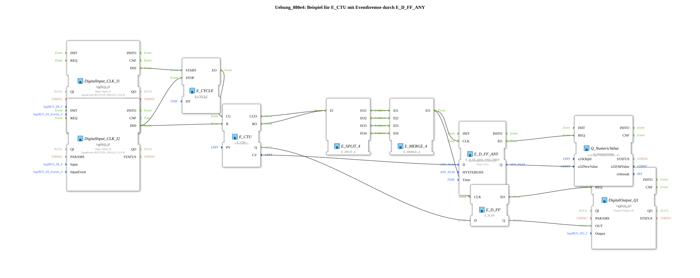

# Exercise_080e4: Example of an E_CTU with Event Brake using E_D_FF_ANY

* * * * * * * * * *
## Introduction
This exercise demonstrates the use of an **E_CTU** (event counter) in combination with an **event brake**, implemented using an **E_D_FF_ANY** (E_D flip-flop with hysteresis and minimum time). The goal is to only forward the counter result to a numerical output if the counter value remains stable for a specific period. This suppresses bounce or short-term fluctuations.
## Function Blocks (FBs) Used

| Block Name | Type | Parameter / Remark |

|-------------|------|-----------------------|

| `DigitalInput_CLK_I1` | `logiBUS::io::DI::logiBUS_IE` | `Input = Input_I1`, `InputEvent = BUTTON_SINGLE_CLICK` |

DigitalInput_CLK_I2` | `logiBUS::io::DI::logiBUS_IE` | `Input = Input_I2`, `InputEvent = BUTTON_SINGLE_CLICK` |

E_CYCLE` | `iec61499::events::E_CYCLE` | `DT = T#1ms` (Clock generator for counting pulses) |

E_CTU` | `iec61499::events::E_CTU` | `PV = UINT#5` (Counting threshold) |

E_SPLIT_4` | `iec61499::events::E_SPLIT_4` | Distributes one event across four outputs |

E_MERGE_4` | `iec61499::events::E_MERGE_4` | Collects events from four inputs into one output |

E_D_FF_ANY` | `logiBUS::signalprocessing::hysteresis::E_D_FF_ANY_HYS_TMIN` | `HYSTERESIS = UINT#25`, `Tmin = T#1s` (Hysteresis and minimum time to stable state) |

E_D_FF` | `iec61499::events::E_D_FF` | Standard D flip-flop for binary output |

Q_NumericValue` | `isobus::UT::Q::Q_NumericValue` | `u16ObjId = OutputNumber_N1` (Output of a numerical value) |

| `DigitalOutput_Q1` | `logiBUS::io::DQ::logiBUS_QX` | `Output = Output_Q1` (Digital output) |

## Program Flow and Connections

### Event and Data Flow

1. **Generating Count Pulses**

The clock generator `E_CYCLE` is started as soon as `DigitalInput_CLK_I1` sends an event (`IND`). It is stopped by an event from `DigitalInput_CLK_I2`.

# Program Flow and Connections

### Event and Data Flow

1. **Generating Count Pulses**

The clock generator `E_CYCLE` is started as soon as `DigitalInput_CLK_I1` sends an event (`IND`). It is stopped by an event from `DigitalInput_CLK_I2`. The cyclic event output `EO` from `E_CYCLE` triggers the **counter input `CU`** from `E_CTU`.

2. **Counter Reset**

An event from `DigitalInput_CLK_I2` is additionally routed to the **Reset Input `R`** from `E_CTU`.

3. **Counter Outputs**

The counter outputs two events:

- `CUO` (Counter Overflow) – becomes active when the counter value `CV` reaches the parameter `PV` (here 5).
- `RO` (Reset Overflow) – is activated when the counter is reset and exceeds its range (not relevant here, but both events are used).

4. **Event Distribution and Merging**

CUO` and `RO` are jointly routed to input `EI` of `E_SPLIT_4`.

E_SPLIT_4` distributes each incoming event to all four outputs `EO1`…`EO4`. These four outputs are connected to the four inputs `EI1`…`EI4` of `E_MERGE_4`.

**Effect:** Every event from `E_CTU` (whether `CUO` or `RO`) is immediately passed to the output `EO` of `E_MERGE_4` – creating a **logical OR** connection between the two events.

5. **Event Brake via `E_D_FF_ANY`**

The combined event feeds the **clock input `CLK`** from `E_D_FF_ANY`. This function block only passes the **data value `D`** (the current counter reading `CV`) to the output `Q` if the value remains stable for at least `Tmin = 1s` (hysteresis of `25` units).

This filters out short spikes in the counter reading.

`` 6. **Numerical Output**

The stable counter value `Q` from `E_D_FF_ANY` is passed via the data connection to input `u32NewValue` of `Q_NumericValue`. The event `EO` from `E_D_FF_ANY` triggers the output via input `REQ`.

7. **Digital Output**

Simultaneously, the same combined event from `E_MERGE_4` is also routed to the **clock input `CLK`** of a standard `E_D_FF`. This output takes the **binary data value `Q`** from `E_CTU` (the counter status: whether the threshold has been reached) and passes it via `EO` to `DigitalOutput_Q1`.

The output `DigitalOutput_Q1` is therefore always activated when the counter reaches its end value or is reset.

### Learning Objectives
- Understanding **E_CTU (Event Counter)** and its event outputs `CUO` and `RO`.
- Using **E_SPLIT_4** and **E_MERGE_4** for event control.
- Applying an **E_D_FF_ANY with hysteresis and minimum time** to suppress short-term changes (event dampening).
- Interaction of **numeric and digital outputs** based on counter events.

### Difficulty Level

**Advanced** – Basic knowledge of the 4diac IDE and IEC 61499 event/data flows is required.

### Required Prior Knowledge
- Fundamentals of the 4diac IDE: Creating sub-applications, connecting function blocks.
- Understanding of event and data edges.
- Experience with logiBUS and isobus libraries (when using hardware simulation).

### Starting the Exercise

1. Import the sub-application `Uebung_080e4` into your 4diac project.

2. Ensure that the required libraries (`logiBUS`, `iec61499`, `isobus`) are available.

3. Assign the inputs/outputs `Input_I1`, `Input_I2`, `Output_Q1`, and `OutputNumber_N1` to appropriate hardware or simulation addresses.

4. Start the execution and observe the behavior when the buttons are pressed (I1 start/stop clock, I2 reset).

## Summary

This exercise demonstrates how an **E_CTU** can output both a **stabilized counter value** and an **immediate binary status** using **E_D_FF_ANY** and **E_D_FF**. Event processing via split/merge ensures that both overflow and reset events are treated equally. This is typical for applications where a counter value is only processed after a certain settling time (e.g., debouncing sensor data).

---

### 🌐 Related topic subpages on ms-muc-docs.de
* [🌐 E_CTU Event Counter Block on ms-muc-docs.de](https://www.ms-muc-docs.de/iec-61499/event-function-blocks/e_ctu/)
* [🌐 Eclipse 4diac IDE & Color Reference on ms-muc-docs.de](https://www.ms-muc-docs.de/iec-61499/eclipse-4diac/)
* [🌐 IEC 61499 Events – The Pulse of Automation on ms-muc-docs.de](https://www.ms-muc-docs.de/iec-61499/events/event/)

