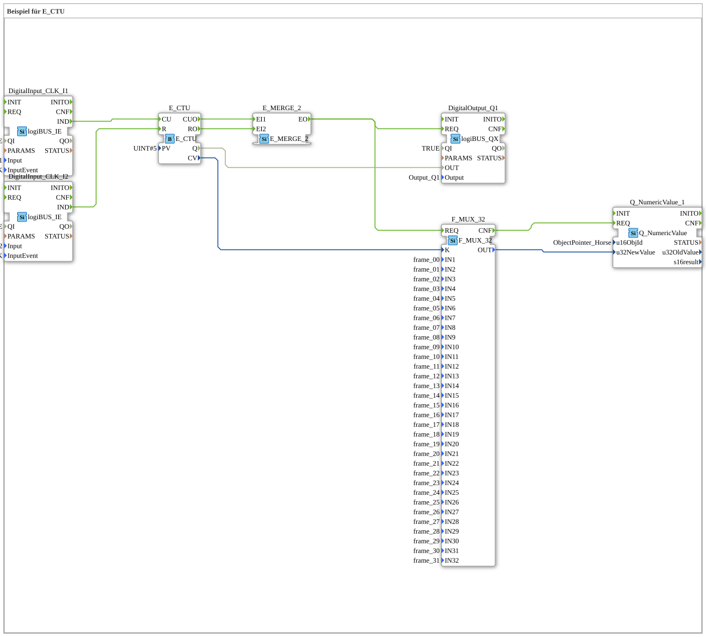

# Exercise_080f: Example for E_CTU

* * * * * * * * * *
## Introduction
This exercise demonstrates the use of the event-driven increment counter `E_CTU` according to IEC 61499. The counter is incremented and decremented using two pushbuttons. The current counter value is displayed on a numeric display as an animated horse (single frames). A digital output is set as soon as the counter reaches the predefined limit.
This exercise is suitable for users who want to take their first steps with counters and event chaining in 4diac.

## Function Blocks (FBs) Used

### Sub-Blocks: Input Logic (Buttons)
- **DigitalInput_CLK_I1 (Type: `logiBUS::io::DI::logiBUS_IE`)**
- Parameters:
- `QI` = `TRUE`
- `Input` = `Input_I1`
- `InputEvent` = `BUTTON_SINGLE_CLICK`
- Function: Provides the first button (I1) as an event source. Each simple click generates an event `IND`.
- **DigitalInput_CLK_I2 (Type: `logiBUS::io::DI::logiBUS_IE`)**
- Parameters:
- `QI` = `TRUE`
- `Input` = `Input_I2`
- `InputEvent` = `BUTTON_SINGLE_CLICK`
- Function: Provides the second button (I2) as an event source. Each single click generates an event `IND`.

### Sub-Block: Up Counter
- **E_CTU (Type: `iec61499::events::E_CTU`)**
- Parameters:
- `PV` = `UINT#5` (Limit)
- Function: An event-driven up counter. Each event at input `CU` increments the internal counter CV by 1 and triggers `CUO`. An event at input `R` resets the counter to 0 and triggers `RO`. The output `Q` becomes `TRUE` once `CV >= PV` is reached.

```
### Sub-module: Event Merger

- **E_MERGE_2 (Type: `iec61499::events::E_MERGE_2`)**
- Function: Combines two event inputs (`EI1`, `EI2`) into a single event output `EO`. As soon as one of the two events occurs, `EO` is triggered.

### Sub-module: Output Logic (Digital Output)
- **DigitalOutput_Q1 (Type: `logiBUS::io::DQ::logiBUS_QX`)**
- Parameters:
- `QI` = `TRUE`
- `Output` = `Output_Q1`
- Function: Switches the digital output Q1. The value at data input `OUT` is updated when an event arrives at `REQ`.

### Sub-module: Multiplexer
- **F_MUX_32 (Type: `iec61131::selection::F_MUX_32`)**
- Parameters:
- `IN1` … `IN32` = constants `frame_00` … `frame_31` (32 individual frames of a horse animation)
- Function: A 32-way multiplexer. Depending on the value at the selection input `K` (0 … 31), the corresponding file output `INx` is routed to the output `OUT`.

### Sub-Block: Numeric Display
- **Q_NumericValue_1 (Type: `isobus::UT::Q::Q_NumericValue`)**
- Parameters:
- `u16ObjId` = `ObjectPointer_Horse`
- Function: Displays a passed 32-bit value (`u32NewValue`) numerically (here: as an animated horse across the individual frames). An event at `REQ` updates the display.

## Program Flow and Connections

The flow is controlled by events:

1. **Counter Input**

- A click on button I1 generates an event `IND` at the block `DigitalInput_CLK_I1`.
- This event is directly routed to input `CU` of `E_CTU`. The counter increments by 1.

2. **Reset**

- Clicking button I2 generates an event `IND` at `DigitalInput_CLK_I2`.
- This event is routed to input `R` of `E_CTU`. The counter is reset to 0.

3. **Event Merging**

- Both the output `CUO` (after counter increment) and `RO` (after reset) of `E_CTU` are connected to the inputs `EI1` and `EI2` of `E_MERGE_2`.
- The merged output `EO` is activated with every counter change.

`` 4. **Display and Output Update**

- The common event `EO` is forwarded in parallel to two components:
- **Multiplexer**: The event reaches the `REQ` input of `F_MUX_32`. The current counter value `CV` (data connection from `E_CTU.CV` to `F_MUX_32.K`) selects the appropriate frame. The multiplexer outputs the selected frame at its output `OUT`.
- **Digital Display**: After the multiplexer has finished (`CNF` event), the event is passed to the `REQ` input of `Q_NumericValue_1`. The multiplexer's data value `OUT` is then used as the new display value.
- Simultaneously, the event `EO` is also sent to the `REQ` input of `DigitalOutput_Q1`. The logical value `Q` of `E_CTU` (TRUE if `CV >= 5`) is written to output Q1.

... 5. **Network Comments**

- One comment points out that a type conversion from `UINT` to `UDINT` is unnecessary when connecting `CV` → `K`, since `UDINT` can always accommodate `UINT`.
- Another comment explains that while `E_MERGE_2` could be omitted, its inclusion keeps the code cleaner (avoiding crossed lines).

## Summary

This exercise demonstrates the practical use of an event-driven upcounter (`E_CTU`) in a 4diac environment. Learning outcomes:

- Understanding the interplay of event and data flows.
- Using a counter with event reset.
- Using a multiplexer to select constants (image frames).
- Combining hardware inputs (pushbuttons) and outputs (digital output, display).

Prerequisites: Basic knowledge of IEC 61499 event processing and the 4diac IDE. The exercise can be performed directly in a simulation project or on actual logiBUS hardware.

---

### 🌐 Related topic subpages on ms-muc-docs.de
* [🌐 E_CTU Event Counter module on ms-muc-docs.de](https://www.ms-muc-docs.de/iec-61499/event-function-blocks/e_ctu/)
* [🌐 Eclipse 4diac IDE & Color Reference on ms-muc-docs.de](https://www.ms-muc-docs.de/iec-61499/eclipse-4diac/)
* [🌐 IEC 61499 Events – The Pulse of Automation on ms-muc-docs.de](https://www.ms-muc-docs.de/iec-61499/events/event/)

*
