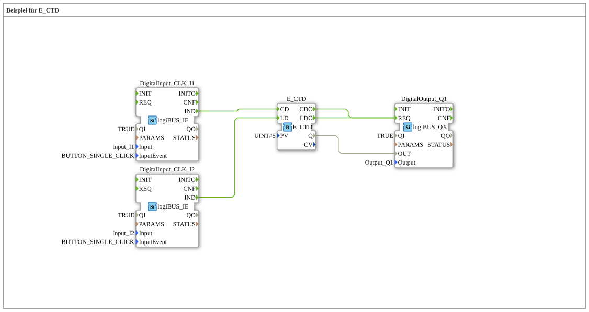

# Exercise_081: Example for E_CTD

This article describes the logiBUS® exercise `Uebung_081`. It demonstrates the principle of counting down until the zero limit is reached.
----
## Objective of the Exercise

Using the function block `E_CTD` (Event Count Down). It demonstrates how a counter is loaded with a starting value and decremented to zero by events.

-----

## Description and Components

[cite_start]In `Uebung_081.SUB`, a down counter is used to control an output [cite: 1].

### Function Blocks (FBs)

* **`I1` (Count Down)**: Decrements the counter value with each click.
* **`I2` (Load)**: Loads the counter with the default value (`PV`).
* **`E_CTD`**: The counter block. [cite_start]The parameter `PV` is set to 5[cite: 1].
* **`DigitalOutput_Q1`**: Signals that the zero limit has been reached.

-----

## Functionality

1. **Load**: A click on **I2** triggers the input `LD`. The counter reading immediately jumps to
5. Output `Q` becomes `FALSE`.
2. **Counting**: Each click on **I1** (`CD`) decreases the counter reading (4, 3, 2, 1, 0).
3. **Limit**: As soon as the reading reaches zero (`CV <= 0`), output `Q` changes to `TRUE`.
4. The lamp on **Q1** illuminates.

-----

## Application Example

**Remaining Quantity Display**:

There are 5 units in a seed container. A pulse (`CD`) is triggered with each rotation of the dosing mechanism. As soon as the counter reaches zero, an alarm (`Q1`) is triggered to prompt the driver to refill.