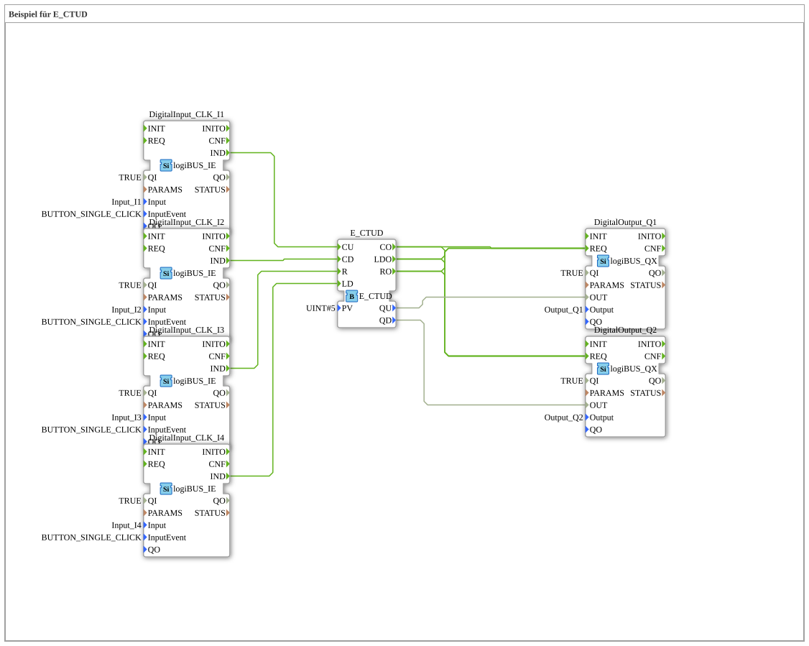

# Exercise_082: Example for E_CTUD

[](https://notebooklm.google.com/notebook/a6872e59-1dfc-4132-a118-aff1bc7bc944)

This article describes the logiBUS® exercise `Uebung_082`. Here, both counting directions are combined in a single function block.

----

## Objective of the Exercise

Using the function block `E_CTUD` (Event Count Up/Down). It demonstrates how to manage the fill level of a storage tank that has both inflows and outflows.

-----

## Description and Components

[cite_start]The sub-application `Uebung_082.SUB` uses four pushbuttons for complete control of the counter[cite: 1].


### Function Blocks (FBs)



* **`I1` (CU)**: Counts up.

* **`I2` (CD)**: Counts down.

* **`I3` (R)**: Resets the counter to zero.

* **`I4` (LD)**: Loads the counter with the value 5 (`PV`).

* **`Q1` (Upper Limit)**: Lights up when the counter value is >= 5.

* **`Q2` (Lower Limit)**: Lights up when the counter value is <= 0.


-----

## Functionality

This function block monitors two thresholds simultaneously:

* The output `QU` reacts to the upper limit (`PV`).

* The output `QD` reacts to the lower limit (zero).

This enables seamless monitoring of inventory or items within a defined work area.

--

### 🌐 Related topic subpages on ms-muc-docs.de

* [🌐 E_CTU Event Counter function block on ms-muc-docs.de ](https://www.ms-muc-docs.de/iec-61499/event-function-blocks/e_ctu/)


```