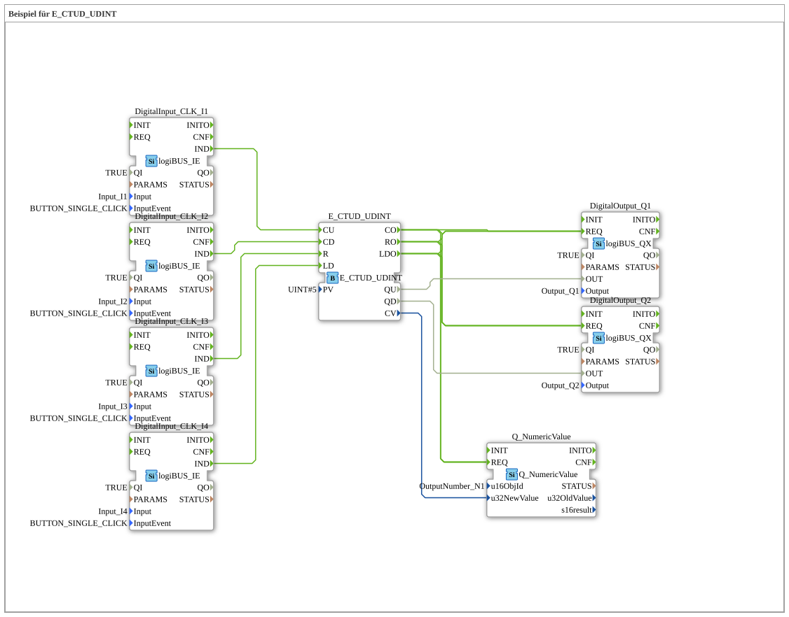

# Exercise_083: Example for E_CTUD_UDINT

[](https://notebooklm.google.com/notebook/a6872e59-1dfc-4132-a118-aff1bc7bc944)

This article describes the logiBUS® exercise `Uebung_083`.


Exercise #083: Example for E_CTUD_UDINT

[](https://notebooklm.google.com/notebook/a6872e59-1dfc-4132-a118-aff1bc7bc944)

]

``` ## 🎧 Podcast



* "Store Version" – Your Key to Managing Object Data Pools in Non-Volatile Virtual Terminal Memory (ISO 11783-6) ](https://podcasters.spotify.com/pod/show/isobus-vt-objects/episodes/Store-Version--Dein-Schlssel-zur-Verwaltung-von-Objektdatenpools-im-nichtflchtigen-VT-Speicher-ISO-11783-6-e36vfh0)

* ISO 11783-6: Understanding Softkeys and the Virtual Terminal – Your Key to Agricultural Machinery Mechatronics ](https://podcasters.spotify.com/pod/show/isobus-vt-objects/episodes/ISO-11783-6-Softkeys-und-das-Virtual-Terminal-verstehen--Dein-Schlssel-zur-Landmaschinen-Mechatronik-e36a8b0)

* ISOBUS Scaling: When the Tractor Screen Doesn't Fit – An Introduction to ISO 11783-6 ](https://podcasters.spotify.com/pod/show/isobus-vt-objects/episodes/ISOBUS-Skalierung-Wenn-der-Ackerschlepper-Bildschirm-nicht-passt--Eine-Einfhrung-in-ISO-11783-6-e36a8q6)

* ISOBUS Bar Graph: The Output Linear Bar Graph Object of ISO 11783-6 Decoded ](https://podcasters.spotify.com/pod/show/isobus-vt-objects/episodes/ISOBUS-Balkendiagramm-Das-Output-Linear-Bar-Graph-Objekt-der-ISO-11783-6-entschlsselt-e36l0v2)

* ISOBUS User Interfaces: When Buttons and Main Display Scale Differently – ISO 11783-6 decrypted](https://podcasters.spotify.com/pod/show/isobus-vt-objects/episodes/ISOBUS-Bedienoberflchen-Wenn-Tasten-und-Hauptanzeige-unterschiedlich-skalieren--ISO-11783-6-entschlsselt-e36a8n8)

----

## Overview

[cite_start]This exercise uses the function block `E_CTUD_UDINT`[cite: 1]. Unlike the standard counter (which usually only counts up to 65,535), this type uses the data type `UDINT` (Unsigned Double Integer). This allows events with a value of over 4 billion to be counted.

In addition to controlling the lamps `Q1` and `Q2`, the current counter reading (`CV`) is sent directly to a numeric display on the ISOBUS terminal. This enables precise monitoring of the counting process in real time.


---

### 🌐 Related topic subpages on ms-muc-docs.de

* [🌐 E_CTU Event Counter module on ms-muc-docs.de](https://www.ms-muc-docs.de/iec-61499/event-function-blocks/e_ctu/)


```