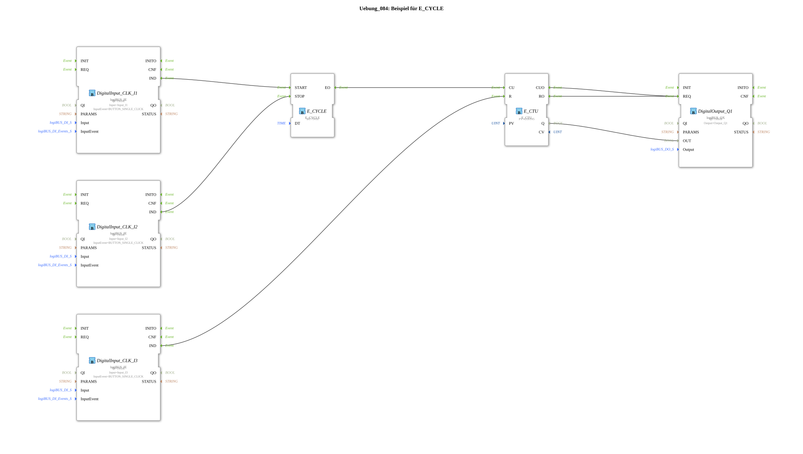

# Exercise_084: Example for E_CYCLE

This article describes the logiBUS® exercise `Uebung_084`. Here, the counter is not controlled manually, but by a clock generator.
----
## Purpose of the Exercise
Combination of a time base (`E_CYCLE`) and an event counter (`E_CTU`).

-----

## Functionality

[cite_start]In `Uebung_084.SUB`, the counter is automatically incremented every second[cite: 1].

* Button **I1** starts the clock generator.
* Every second event from `E_CYCLE` reaches the `CU` input of the counter.
* After 5 seconds, the counter reaches the value 5 and the lamp `Q1` turns on.
* Button **I2** stops the clock (pause).
* Button **I3** resets the counter to zero.

This is the basis for implementing time limits or delayed shutdowns over longer periods.

--

### 🌐 Related topic subpages on ms-muc-docs.de
* [🌐 E_CTU Event Counter block on ms-muc-docs.de](https://www.ms-muc-docs.de/iec-61499/event-function-blocks/e_ctu/)
