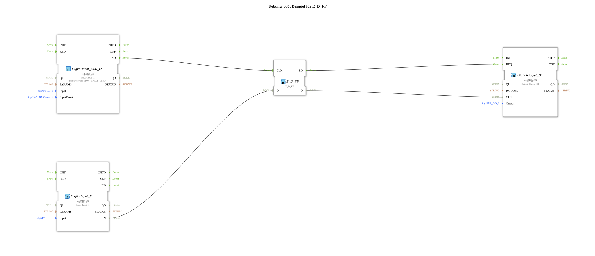

# Exercise_085: Example for E_D_FF

[(https://notebooklm.google.com/notebook/a6872e59-1dfc-4132-a118-aff1bc7bc944)
This article describes the logiBUS® exercise `Uebung_085`. It introduces the principle of the D flip-flop (delay or data flip-flop).
## 🎧 Podcast

* [The relay in detail: switching amplifiers, protection, and the secrets of A1/A2, 85/86, and hysteresis ](https://podcasters.spotify.com/pod/show/ms-muc-lama/episodes/Das-Relais-im-Detail-Schaltverstrker--Schutz-und-die-Geheimnisse-von-A1A2--8586-und-der-Hysterese-e3audsc)

----

## Objective of the exercise

Using the function block `E_D_FF`. The goal is to only accept a data value (TRUE/FALSE) at the moment a clocking event occurs.

-----

## Description and Components

[cite_start]The subapplication `Uebung_085.SUB` uses one data input and one click event input[cite: 1].

### Function Blocks (FBs)

* **`I1` (Data)**: Provides the target state.
* **`I2` (Clock)**: Provides the takeover pulse.
* **`E_D_FF`**: The memory block. [cite_start]It only transfers the value at input `D` to output `Q` if an event is received at input `CLK`[cite: 1].

-----

## Functionality

The output `Q1` does not immediately respond to the switch `I1`.

1. The user sets the switch `I1` to TRUE. Nothing happens at the output.
2. Only when the user additionally clicks button **I2** is `TRUE` loaded into the flip-flop and the lamp lights up.
3. If `I1` is set back to FALSE, the lamp remains on until **I2** is clicked again.

This is a fundamental method for the time-synchronization of signals in digital technology.
