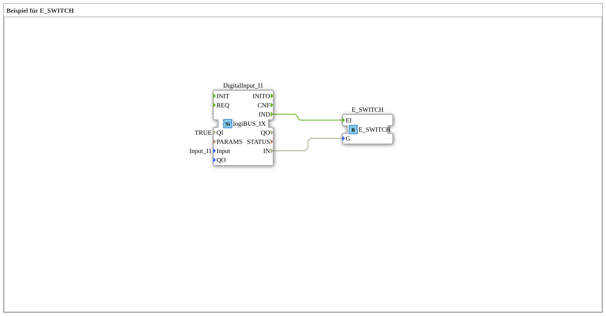

# Exercise_086: Example for E_SWITCH

This article describes the logiBUS® exercise `Uebung_086`.
## 📺 Video

* [The 1863 Catalog ](https://www.youtube.com/watch?v=fk7tIjl2pTk)

## 🎧 Podcast
* [The Relay in Detail: Switching Amplifiers, Protection, and the Secrets of A1/A2, 85/86, and Hysteresis ](https://podcasters.spotify.com/pod/show/ms-muc-lama/episodes/Das-Relais-im-Detail-Schaltverstrker--Schutz-und-die-Geheimnisse-von-A1A2--8586-und-der-Hysterese-e3audsc)
* [The 1863 Technology Panorama: Lanz & Comp. and the revolution of German agriculture through import, innovation, and guano

----

## Overview

[cite_start]Using the fundamental building block `E_SWITCH`[cite: 1].

This exercise demonstrates how an event stream (`EI`) is split into two different paths based on a logical state (`G`).

* If the switch `I1` is set to `FALSE`, the `IND` event ends up at output `EO0`.
* If the switch `I1` is set to `FALSE`, the `IND` event will be output at `EO0`.

`` * If the switch `I1` is set to `TRUE`, the `IND` event will be output at `EO1`.

This is the basis for every conditional program execution ("If-Then-Else") in IEC 61499.
