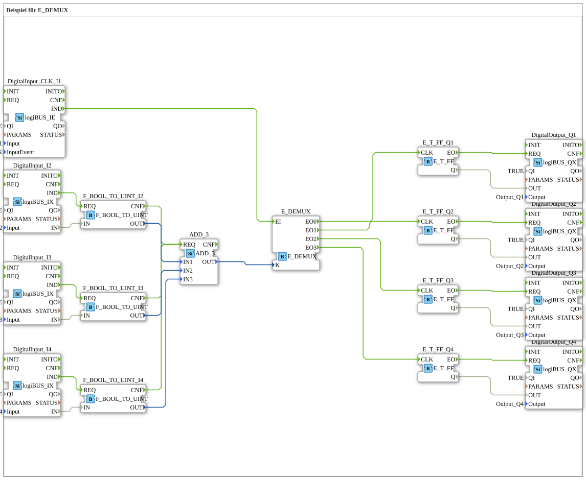

# Exercise_087: Example for E_DEMUX

This article describes the logiBUS® exercise `Uebung_087`. It demonstrates the selection of an event path using a combination of logic values.
----
## Objective of the Exercise
Using `E_DEMUX` (Event Demultiplexer). It shows how a central "execution event" (clicking button 1) is routed to various actuators, with the selection made via the combination of other buttons.

-----

## Description and Components

[cite_start]The subapplication `Uebung_087.SUB` uses addition logic to control the selector input of the demultiplexer[cite: 1].

### Function Blocks (FBs)

* **`I1` (Trigger)**: The event to be distributed.
* **`I2`, `I3`, `I4` (Selector)**: Determine the destination.
* **`ADD_3`**: Sums the states of buttons 2, 3, and 4.
* **`E_DEMUX`**: Forwards the event from `I1` to the output whose number corresponds to the calculated sum.

-----

## Functionality

The number of pressed "selector buttons" determines which lamp toggles when **I1** is clicked:

* No selector button pressed ➡️ Total = 0 ➡️ Clicking I1 toggles **Q1**.
* One selector button pressed ➡️ Total = 1 ➡️ Clicking I1 toggles **Q2**.
* Two selector buttons pressed ➡️ Total = 2 ➡️ Clicking I1 toggles **Q3**.
* All three selector buttons pressed ➡️ Total = 3 ➡️ Clicking I1 toggles **Q4**.

----

## Application Example

**Indirect Addressing**:

An operator selects a group of nozzles using toggle switches on their control panel. Only when he presses the central foot switch (`I1`) will the command be sent to the selected group.