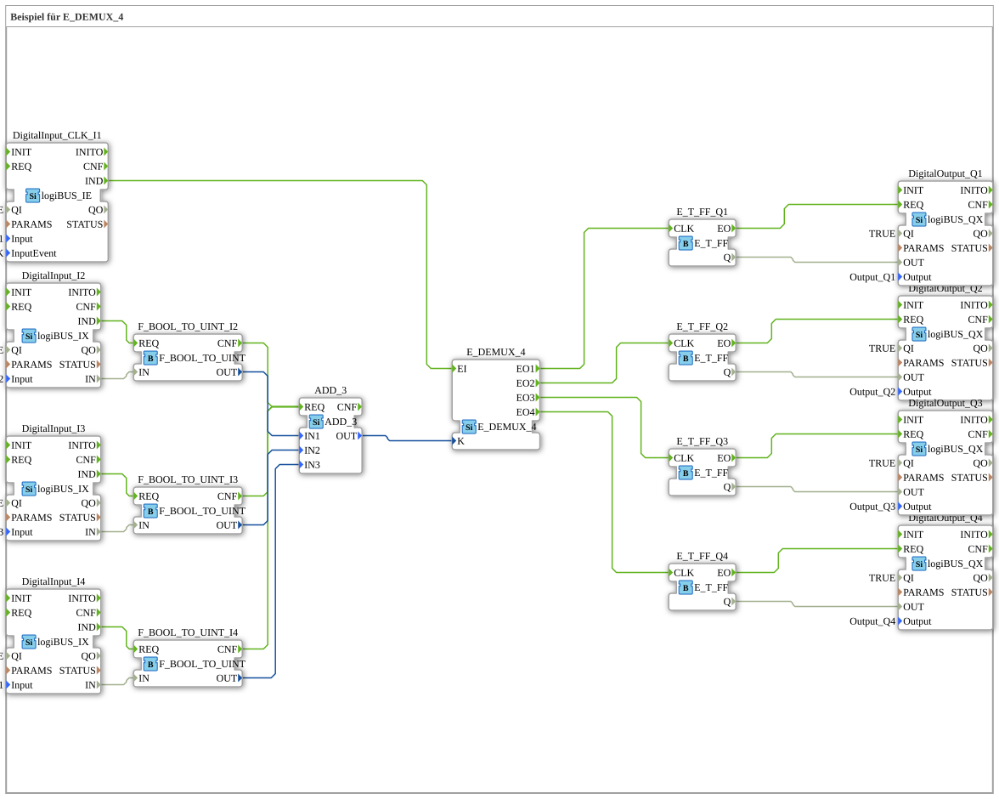

# Exercise_087a1: Example for E_DEMUX_4

* * * * * * * * * *

## Introduction

This exercise demonstrates the use of the E_DEMUX_4 function block in a control system. The program counts the number of active inputs and distributes events accordingly to different outputs. The exercise shows the combination of event processing and data processing in an IEC 61499 system.

## Function Blocks (FBs) Used

### Main Blocks

- **E_DEMUX_4**: Event Demultiplexer with 4 outputs
- **ADD_3**: Adder with 3 inputs
- **E_T_FF**: T Flip-Flop (4 instances for Q1-Q4)
- **F_BOOL_TO_UINT**: Type conversion from BOOL to UINT (3 instances)
- **logiBUS_IX**: Digital inputs (4 instances)
- **logiBUS_QX**: Digital outputs (4 instances)

### Sub-Blocks

- **logiBUS_IX** (Digital inputs)
- **Type**: Hardware input block
- **Parameters**:
- QI = TRUE (enabled)
- Input = logiBUS_DI::Input_Ix (hardware mapping)
- InputEvent = logiBUS_DI_Events::BUTTON_SINGLE_CLICK (only for CLK_I1)
- **logiBUS_QX** (Digital Outputs)
- **Type**: Hardware Output Block
- **Parameters**:
- QI = TRUE (enabled)
- Output = logiBUS_DO::Output_Qx (hardware assignment)

## Program Flow and Connections

### Signal Flow

1. **Input Processing**:

- Three digital inputs (I2, I3, I4) are converted to UINT values via F_BOOL_TO_UINT
- A dedicated clock input (CLK_I1) with single-click detection
1. **Calculation**:

- The three UINT values are summed in the ADD_3 block
- The result determines the output channel of E_DEMUX_4
1. **Event Distribution**:

- E_DEMUX_4 distributes the clock event to one of four outputs based on the sum:
- 0 active buttons → Q1
- 1 active button → Q2
- 2 active buttons → Q3
- 3 active buttons → Q4
1. **Output Control**:

- Four T flip-flops (E_T_FF) switch the corresponding outputs (Q1-Q4) on each clock event.

### Connections

- **Event Connections**: Link IND events of the inputs with REQ events of the converters and onward to ADD_3 and E_DEMUX_4.
- **Data Connections**: Transmit the input states by converting them to addition and onward to the demultiplexer.

### Learning Objectives

- Understanding the E_DEMUX_4 module
- Combining event and data processing
- Working with hardware inputs/outputs in the logiBUS system
- Implementing counters and Distribution Logic

### Difficulty Level: Medium

### Prerequisites: Basic IEC 61499, event processing, data conversion

## Summary

This exercise demonstrates a practical example of using an event demultiplexer in combination with arithmetic operations. The system counts activated inputs and distributes clock events accordingly to different outputs. The implementation effectively demonstrates the integration of hardware inputs/outputs with logical processing in an IEC 61499-compliant control system.
