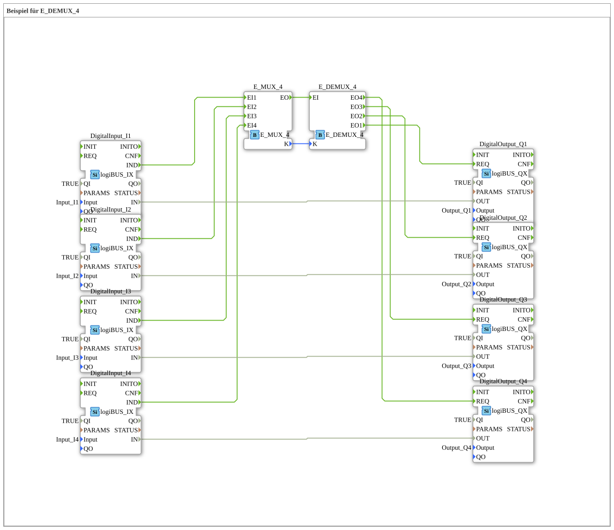

# Exercise_087a2: Example for E_DEMUX_4



* * * * * * * * * *

## Introduction
This exercise demonstrates the functionality of the E_DEMUX_4 module in the 4diac IDE. The application shows how events can be distributed via a multiplexer and demultiplexer to control various digital outputs.


``` ## Function Blocks (FBs) Used

This exercise uses the following main function blocks:

- **E_MUX_4**: 4-way event multiplexer
- **E_DEMUX_4**: 4-way event demultiplexer
- **DigitalInput_I1-I4**: Digital inputs (logiBUS_IX)
- **DigitalOutput_Q1-Q4**: Digital outputs (logiBUS_QX)

## Program Flow and Connections

### Event Connections:

- The IND events of the four digital inputs (I1-I4) are connected to the corresponding inputs of the E_MUX_4 block.

- The output EO of the E_MUX_4 is connected to the input EI of the E_DEMUX_4.

- The four outputs of the E_DEMUX_4 (EO1-EO4) are connected to the REQ inputs of the corresponding digital outputs (Q1-Q4).

### Data connections:

- The K output of the E_MUX_4 is connected to the K input of the E_DEMUX_4.

- Each digital input is directly connected to its corresponding digital output (I1→Q1, I2→Q2, I3→Q3, I4→Q4).

### Functionality:

The E_MUX_4 chip collects events from the four digital inputs and forwards them via a common output. The E_DEMUX_4 chip distributes these events to the corresponding digital outputs based on the K value. The direct data connections between inputs and outputs ensure a 1:1 signal transmission.


``` ## Learning Objectives

- Understanding the functionality of multiplexers and demultiplexers

- Working with event and data connections in 4diac

- Implementing signal distribution systems
- Using the logiBUS interfaces for digital inputs and outputs

## Difficulty Level
Medium - Basic knowledge of 4diac and IEC 61499 is required

## Prerequisites
- Fundamentals of the IEC 61499 standard
- Familiarity with the 4diac IDE interface
- Understanding of event and data flows

## Summary
This exercise provides practical experience with event multiplexing and demultiplexing in 4diac. It demonstrates how complex signal distributions can be implemented using the standard E_MUX_4 and E_DEMUX_4 function blocks. The direct connection between digital inputs and outputs simultaneously demonstrates fundamental signal processing in automation systems.


---

### 🌐 Related topic subpages on ms-muc-docs.de

* [🌐 Eclipse 4diac IDE & Color Reference on ms-muc-docs.de](https://www.ms-muc-docs.de/iec-61499/eclipse-4diac/)

]