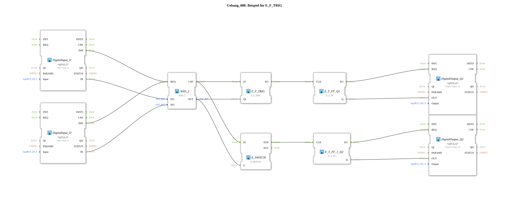

# Exercise_088: Example for E_F_TRIG

[(https://notebooklm.google.com/notebook/a6872e59-1dfc-4132-a118-aff1bc7bc944)
This article describes the logiBUS® exercise `Uebung_088`. It demonstrates the targeted response to the end of a signal (falling edge).

## 🎧 Podcast

- [Agricultural Revolution 1883: How Max Eyth Modernized England's Agriculture ](https://podcasters.spotify.com/pod/show/ms-muc-lama/episodes/Agrar-Revolution-1883-Wie-Max-Eyth-Englands-Landwirtschaft-modernisierte-e36faae)

----

## Objective of the Exercise

Using the function block `E_F_TRIG` (Falling Edge Trigger). Unlike the simple `E_SWITCH`, this block filters out all events except the moment of transition from `TRUE` to `FALSE`.

-----

## Description and Components

[cite_start]In `Uebung_088.SUB`, the response to an AND logic gate is compared[cite: 1].

### Functionality

1. Two pushbuttons, `I1` and `I2`, are connected via a gate, `AND_2`.
2. The result (`OUT`) is present at the input, `QI`, of the edge trigger.

[cite_start]In `Uebung_088.SUB`, the response to an AND logic gate is compared.[cite: 1]

[cite_start] 3. **Positive Edge**: When the buttons are pressed, nothing happens at the output.

1. **Negative Edge**: Only when the AND condition is broken (by releasing **one of the two** buttons) does `E_F_TRIG.EO` fire.
2. The flip-flop toggles, and the lamp changes state.

-----

## Application Example

**Safety Check on Power-Off**:

A cleaning function should only start when the machine's main switch has been turned off. The `F_TRIG` detects this power-off moment and triggers the next step.
