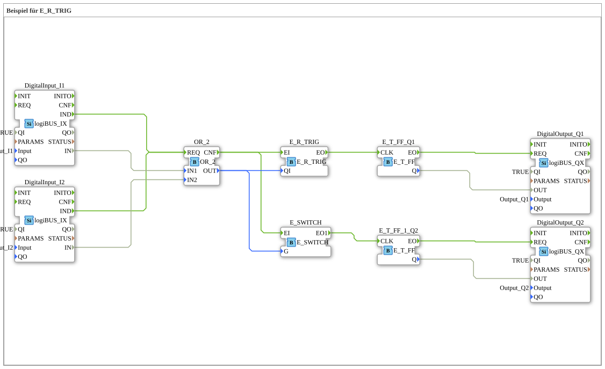

# Exercise_089: Example for E_R_TRIG

This article describes the logiBUS® exercise `Uebung_089`.
## 🎧 Podcast

* [Apple Cider All-Purpose Weapon and Nitrogen Revolution: Middle Franconian Agriculture in 1892 in the Newspaper Check ](https://podcasters.spotify.com/pod/show/ms-muc-lama/episodes/Apfelwein-Allzweckwaffe-und-Stickstoff-Revolution-Die-Landwirtschaft-Mittelfrankens-1892-im-Zeitungs-Check-e39auu2)

----

## Overview

[cite_start]Counterpart to the previous exercise using the building block `E_R_TRIG` (Rising Edge Trigger)[cite: 1].

[cite_start] The flip-flop is triggered precisely when an OR condition (`I1 OR I2`) becomes true. This means that as soon as the **first** of the two buttons is pressed, the lamp toggles. Pressing the second button (while the first is still held) has no effect, as the logic is already set to TRUE and no further rising edge is generated.
