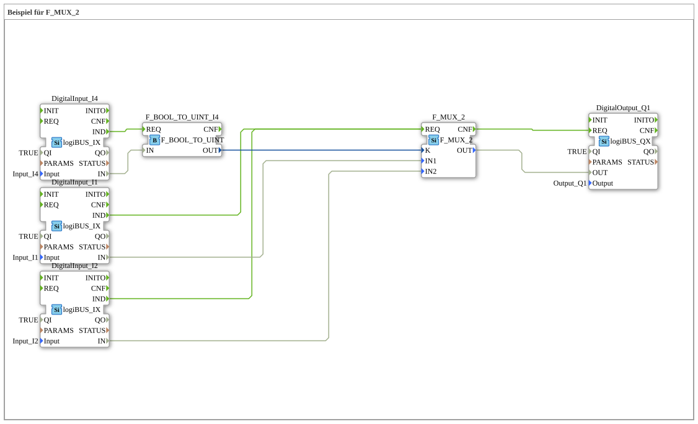

# Exercise_090a1: Example for F_MUX_2

This article describes the logiBUS® exercise `Uebung_090a1`. It demonstrates the selection of a data value based on an address.
----
## Objective of the Exercise

Using the function block `F_MUX_2` (multiplexer). It shows how to switch between two signal sources to operate a common output.

-----

## Description and Components

[cite_start]In `Uebung_090a1.SUB`, a binary selector switch is used to switch between two inputs[cite: 1].

### Function Blocks (FBs)

* **`I1` & `I2` (Sources)**: The data sources.
* **`I4` (Selector)**: Determines which source is enabled.
* **`F_MUX_2`**: The multiplexer block.

-----

## Functionality

* If button **I4** is not pressed (K=0) ➡️ The state of **I1** is passed to output `Q1`.
* If button **I4** is pressed (K=1) ➡️ The state of **I2** is passed to output `Q1`.

This allows switching between operating responsibilities (e.g., between local and remote control).