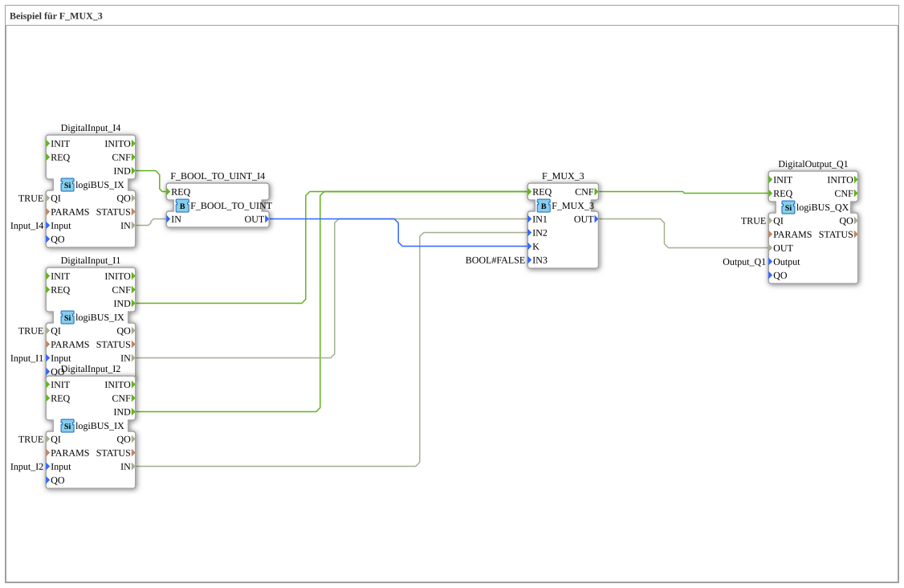

# Exercise_090a2: Example for F_MUX_3



* * * * * * * * * *

## Introduction
This exercise demonstrates the use of the F_MUX_3 multiplexer function block in conjunction with digital inputs and outputs. The exercise shows how a multiplexer can be used to control outputs based on various input signals.

**Note**: This exercise contains a comment indicating that it cannot currently be uploaded.


## Function Blocks Used (FBs)

### F_MUX_3
- **Type**: Multiplexer with 3 inputs
- **Parameters**:

- IN3 = BOOL#FALSE (fixed value for third input)

### DigitalInput_I1, DigitalInput_I2, DigitalInput_I4
- **Type**: logiBUS_IX (digital inputs)
- **Parameters**:

- QI = TRUE (Qualified Input enabled)

- Input = logiBUS_DI::Input_Ix (corresponding hardware inputs)

### F_BOOL_TO_UINT_I4
- **Type**: F_BOOL_TO_UINT (Boolean to Unsigned Integer Converter)

### DigitalOutput_Q1
- **Type**: logiBUS_QX (digital output)

- **Parameters**:

- QI = TRUE (Qualified Output enabled)

- Output = logiBUS_DO::Output_Q1 (Hardware Output Q1)

## Program Flow and Connections

### Event Connections:

- DigitalInput_I4.IND → F_BOOL_TO_UINT_I4.REQ

- F_MUX_3.CNF → DigitalOutput_Q1.REQ

- DigitalInput_I1.IND → F_MUX_3.REQ

- DigitalInput_I2.IND → F_MUX_3.REQ

### Data Connections:

- F_MUX_3.OUT → DigitalOutput_Q1.OUT

- DigitalInput_I1.IN → F_MUX_3.IN1

- DigitalInput_I2.IN → F_MUX_3.IN2

- DigitalInput_I4.IN → F_BOOL_TO_UINT_I4.IN

- F_BOOL_TO_UINT_I4.OUT → F_MUX_3.K

### Functionality:

Based on the control signal K (from F_BOOL_TO_UINT_I4), the multiplexer F_MUX_3 selects one of its three inputs and outputs it at output OUT. Digital inputs I1 and I2 are used as selectable inputs, while IN3 is set to FALSE. Input I4 serves as the control signal, which is converted into the control input K of the multiplexer via the converter F_BOOL_TO_UINT.

## Summary
This exercise illustrates the basic use of a multiplexer in 4diac. It demonstrates how different input signals can be selectively routed to an output via a control signal. The exercise combines digital inputs/outputs with signal processing blocks and type conversions.


``` ---

### 🌐 Related topic subpages on ms-muc-docs.de

* [🌐 Eclipse 4diac IDE & Color Reference on ms-muc-docs.de](https://www.ms-muc-docs.de/iec-61499/eclipse-4diac/)

]