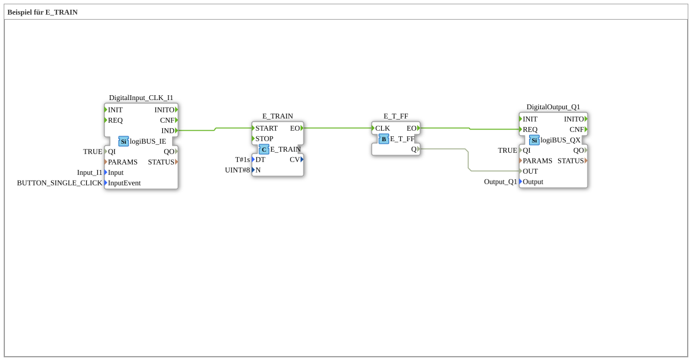

# Exercise_091: Example for E_TRAIN

This article describes the logiBUS® exercise `Uebung_091`. It demonstrates the automatic generation of a fixed number of events.
## 🎧 Podcast

* [As an agricultural machinery specialist through hell: How Lanz-Wery survived war, occupation, and hyperinflation – Insights into original business reports 1915-1922](https://podcasters.spotify.com/pod/show/ms-muc-lama/episodes/Als-Landtechnik-Spezialist-durch-die-Hlle-Wie-Lanz-Wery-Krieg--Besatzung-und-Hyperinflation-berlebte--Einblicke-in-Original-Geschftsberichte-1915-1922-e39athj)
* [Rudolf Diesel: Brilliant work, mysterious end – Who disappeared on the ferry in 1913?](https://podcasters.spotify.com/pod/show/ms-muc-lama/episodes/Rudolf-Diesel-Geniales-Werk--mysterises-Ende--Wer-verschwand-1913-auf-der-Fhre-e396oa6)
* [Smart Farming Vision 1991 Auernhammer's blueprints](https://podcasters.spotify.com/pod/show/ms-muc-lama/episodes/Smart-Farming-Vision-1991-Auernhammers-Blaupausen-e3b09r2)

----

## Objective of the exercise

Using the building block `E_TRAIN`. The goal is to trigger a defined sequence of events after a single start impulse.

-----

## Description and Components

[cite_start]In `Uebung_091.SUB`, an event train is used to control a flip-flop[cite: 1].

### Functionality

1. The user clicks button **I1** once.

2. The function block `E_TRAIN` starts its operation.

3. According to parameters `N=8` and `DT=1s`, the function block now sends exactly **8 events** at one-second intervals.

4. These events are sent to the toggle flip-flop.

5. The lamp on `Q1` then blinks exactly four times (4 on, 4 off) and then remains in its last position.

-----

## Application Example

**Automatic Tipping**:

A hydraulic cylinder is to perform three short, jerking movements to loosen material. Pressing a button triggers a series of six control commands (extension-retraction x 3), after which the control system automatically terminates the process.
