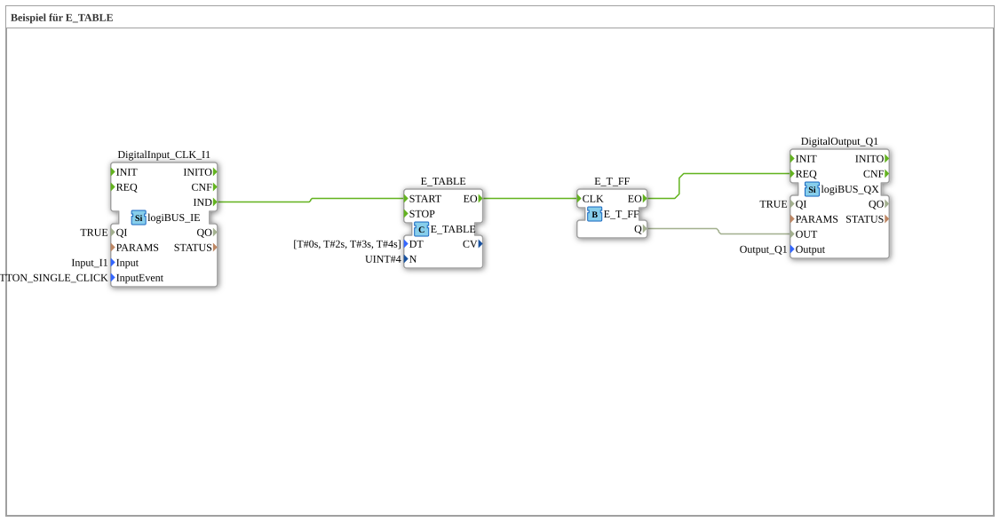

# Exercise_093: Example for E_TABLE

This article describes the logiBUS® exercise `Uebung_093`. Here, a complex timing pattern for events is defined.
## 🎧 Podcast

* [Infineon CAN transceiver TLE9250V versus TLE9351VSJ](https://podcasters.spotify.com/pod/show/ms-muc-lama/episodes/Infineon-CAN-Transceiver-TLE9250V-versus-TLE9351VSJ-e3b8nan)
* [Infineon TLE9351VSJ the invisible car bodyguard](https://podcasters.spotify.com/pod/show/ms-muc-lama/episodes/Infineon-TLE9351VSJ-der-unsichtbare-Auto-Bodyguard-e3b8nhl)

----

## Goal of the exercise

Using the function block `E_TABLE`. Unlike the constant timing of `E_TRAIN`, this function block allows the definition of individual delay times for each event in a list (array).

-----

## Description and Components

[cite_start]A time array is stored in `Uebung_093.SUB`: `[T#0s, T#2s, T#3s, T#4s]`[cite: 1].

### Functionality

Clicking **I1** starts the table:

1. Event 1: Immediately (`0s`).
2. Event 2: After another 2 seconds.
3. Event 3: After another 3 seconds.
4. Event 4: After another 4 seconds.

The connected flip-flop thus generates an irregular blinking pattern at the output `Q1`, which corresponds exactly to the specified schedule. This allows for the programming of specific start sequences or rhythmic processes.
