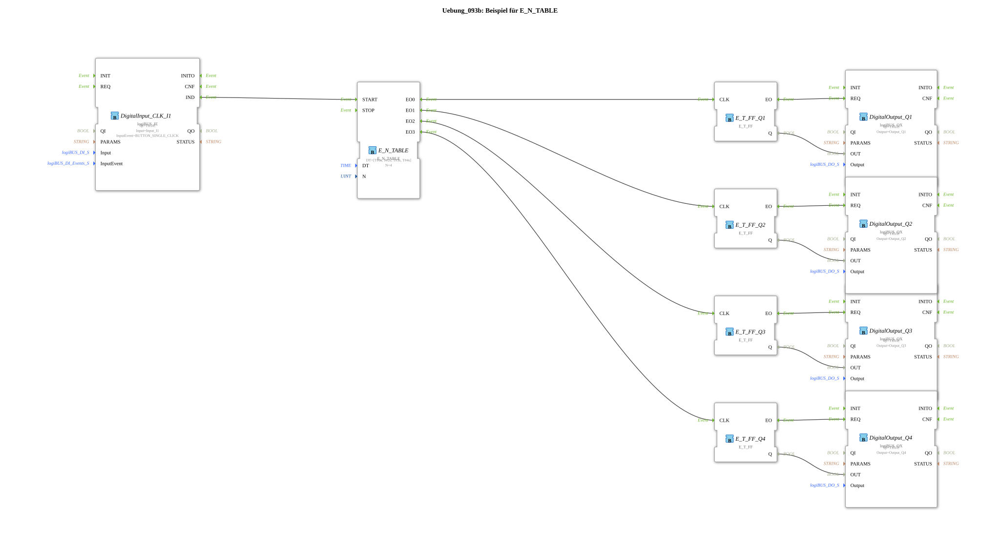

# Exercise_093b: Example for E_N_TABLE

This article describes the logiBUS® exercise `Uebung_093b`.

----

## Overview

[cite_start]Extension of the table concept using the function block `E_N_TABLE`[cite: 1].

Instead of sending all events to a common output, this function block has separate outputs (`EO0` to `EOn`) for each table entry.

In this exercise, four different lamps (`Q1` to `Q4`) are switched on sequentially in a precisely defined, irregular sequence. This is the most efficient method for defining complex startup sequences for multi-actuator systems.

