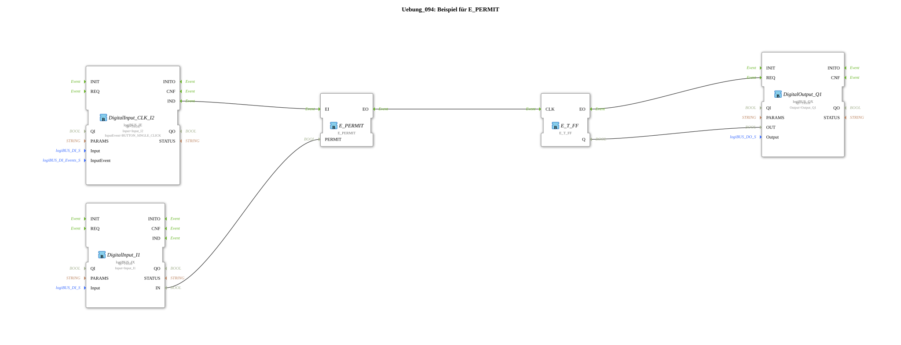

# Exercise_094: Example for E_PERMIT

[(https://notebooklm.google.com/notebook/a6872e59-1dfc-4132-a118-aff1bc7bc944)
This article describes the logiBUS® exercise `Uebung_094`. Here, a protection function for event streams is implemented.
## 🎧 Podcast

- [Constitutional Art 1946: Bavaria's Educational Mission between Patriotism, Democracy, and Reconciliation between Nations ](https://podcasters.spotify.com/pod/show/ms-muc-lama/episodes/Verfassungskunst-1946-Bayerns-Bildungsauftrag-zwischen-Heimatliebe--Demokratie-und-Vlkervershnung-e38dj0l)

----

## Objective of the Exercise

Using the building block `E_PERMIT`. The objective is to make the execution of an action (event) dependent on a condition (data value).

-----

## Functionality

[cite_start]The subapplication `Uebung_094.SUB` uses a switch to enable a push button[cite: 1].

- Push button **I2** provides the trigger pulse.
- Switch **I1** provides the enable signal (`PERMIT`).
- Only when **I1** is set to `TRUE` does the function block forward the click from **I2** to the flip-flop. If the switch is off, the event is ignored.

This is a simple but effective method for implementing interlocks.
