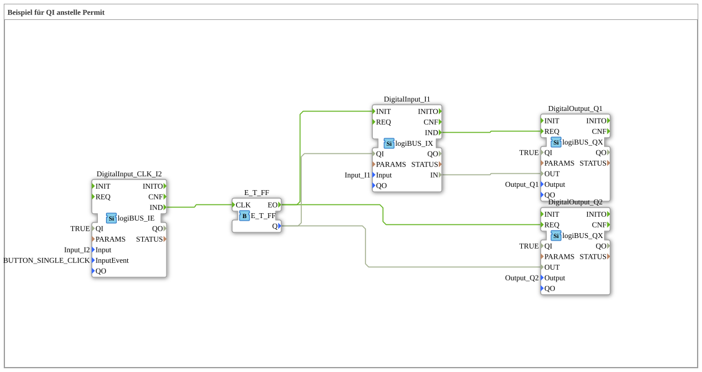

# Exercise_094a: Example of QI instead of Permit

[(https://notebooklm.google.com/notebook/a6872e59-1dfc-4132-a118-aff1bc7bc944)
This article describes the logiBUS® exercise `Uebung_094a`. It demonstrates an alternative method for enabling control that is directly integrated into the function blocks.
----
## Overview

[cite_start]Instead of using an external `E_PERMIT` function block, the standard port `QI` (Qualified Input) of the input function block `DigitalInput_I1` is used here[cite: 1].

The `QI` input is switched on and off via a toggle flip-flop. If `QI` is set to `FALSE`, the entire function block is deactivated and no longer sends any events to the output `Q1`, even if the physical state of the hardware pin changes. This is the cleanest way to put entire function blocks in a program to sleep.

