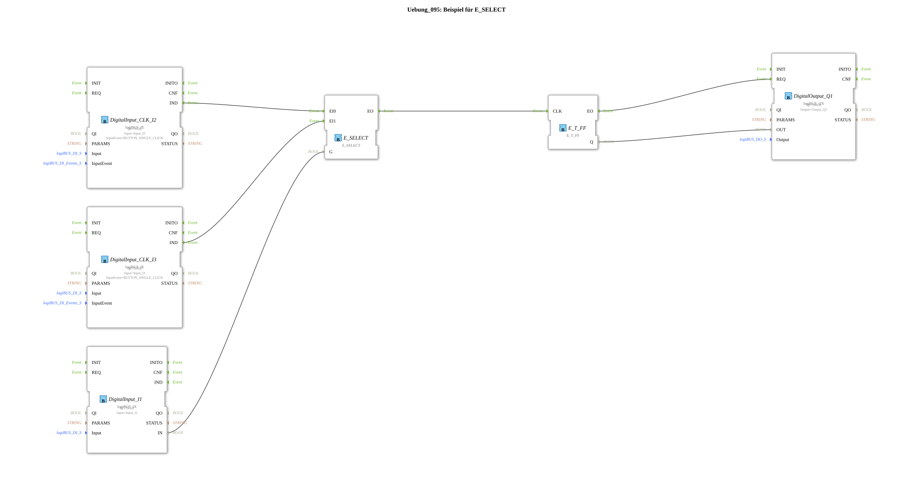

# Exercise_095: Example for E_SELECT

This article describes the logiBUS® exercise `Uebung_095`. It demonstrates the selection between two different event sources.

----

## Objective of the Exercise

Use of the function block `E_SELECT`. This acts as a switch for incoming events (the counterpart to `E_SWITCH`).

-----

## Functionality

[cite_start]In `Uebung_095.SUB`, two pushbuttons and a selector switch determine the logic[cite: 1].

* Switch **I1** acts as a selector (`G`).

* If **I1** is set to `FALSE`, only the event from button **I2** (`EI0`) is passed to the output.

* If **I1** is set to `TRUE`, only the event from button **I3** (`EI1`) is passed to the output.

This allows a common function (here, switching `Q1`) to be triggered selectively by different sources, with the controller actively determining which source is currently "listening."