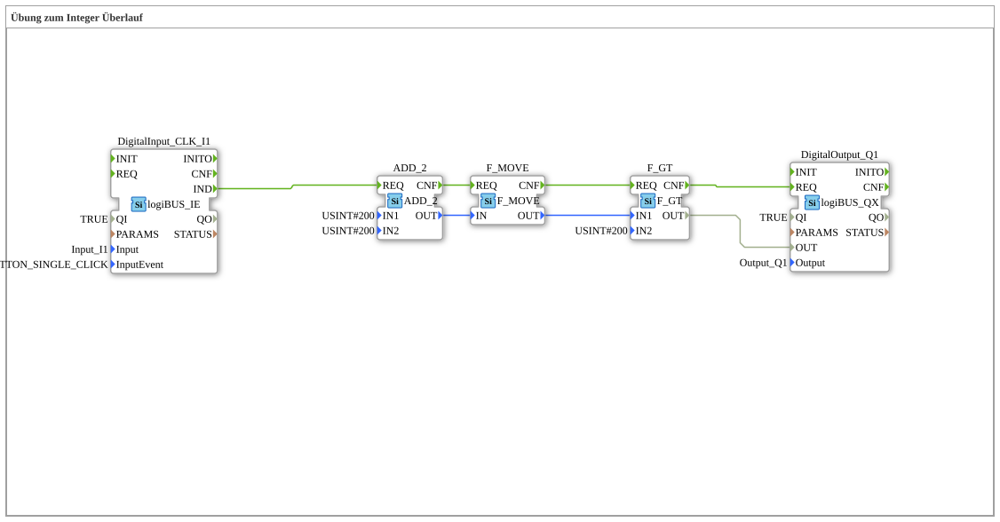

# Exercise_110: Exercise on Integer Overflow

This article describes the logiBUS® exercise `Uebung_110`. It demonstrates an important phenomenon in digital data processing: variable overflow.

----

## Objective of the Exercise

Understanding the limitations of data types. It shows what happens when the result of a calculation exceeds the maximum value range of a data type.

-----

## Description and Components

[cite_start]The subapplication `Uebung_110.SUB` uses the data type `USINT` (Unsigned Short Integer)[cite: 1]. This has a value range from 0 to 255.

### Function Blocks (FBs)

* **`ADD_2`**: Adds two values.

* **Parameters**: `IN1 = 200`, `IN2 = 200`.

* **`F_GT`**: Checks if the result is greater than 200.

-----

## The Experiment

1. Mathematically, `200 + 200 = 400` results in a value of 0.

2. However, since the variable of type `USINT` can only count up to 255, an overflow (wrap-around) occurs.

**Parameters**: `200 + 200 = 400`

**`USINT`** 3. The result in the controller is `400 - 256 = 144`.

4. The comparison `144 > 200` fails (returns `FALSE`).

5. The lamp on `Q1` remains off, even though a "true" value would be expected based on the logic.

-----

## Conclusion

This exercise serves as a reminder to be careful when choosing data types. For values that can exceed 255, a larger type (e.g., `UINT` up to 65,535 or `UDINT`) must be used to avoid logical errors in the controller.