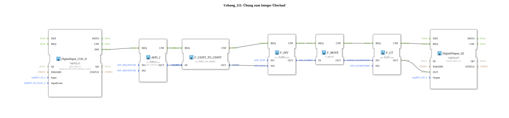

# Exercise_111: Integer Overflow Exercise

This article describes the logiBUS® exercise `Uebung_111`. It demonstrates how to prevent calculation errors by converting to larger data types in a timely manner.

----

## Overview

[cite_start]In `Uebung_111.SUB`, the overflow problem from Exercise 110 is solved[cite: 1].

Before the critical calculation or comparison takes place, the small data type `USINT` is converted into a large 32-bit type using the function block `F_USINT_TO_UDINT`. This provides sufficient "space" for the result, and the subsequent comparison yields the mathematically correct result. This demonstrates the proper handling of different numerical accuracies in the program flow.

