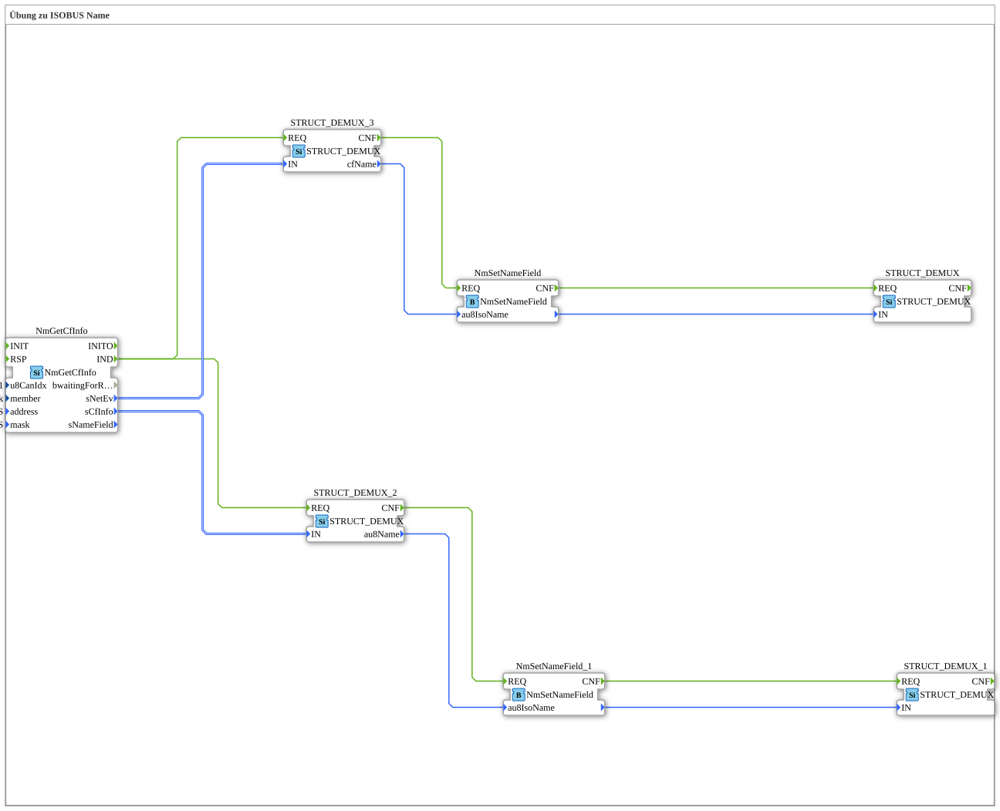

# Exercise_120: ISOBUS Name Exercise

This article describes the logiBUS® exercise `Uebung_120`. It demonstrates how to determine the identity of devices in an ISOBUS network.

----

## Objective of the Exercise

Using the function block `NmGetCfInfo`. Every ISOBUS device has a globally unique 64-bit name (NAME). The goal is to read these names from other participants on the bus and decompose them into their components.

-----

## Description and Components

[cite_start]In `Uebung_120.SUB`, the network is searched for active Control Functions (CFs)[cite: 1].

### Function Blocks (FBs)

* **`NmGetCfInfo`**: Scans the bus for devices.

* **`NmSetNameField`**: Parses the 64-bit raw value into the standardized ISOBUS fields.

* **`STRUCT_DEMUX`**: Makes the individual fields (manufacturer code, device series, instance, etc.) accessible to the program logic.

-----

## Functionality

The function block `NmGetCfInfo` delivers a data packet (`sCfInfo`) containing the name of a device during each scan. The program can then use the downstream analysis blocks to precisely "read" which devices (e.g., a terminal from company X or a joystick from company Y) are currently connected to the tractor. This is a prerequisite for automatic plug-and-play.