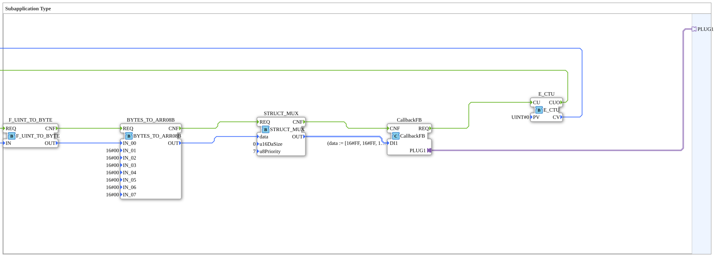

# Exercise_120x_sub: Subapplication Type

* * * * * * * * * *
## Introduction
This sub-application demonstrates the generation of an ISOBUS CAN message with an incrementing counter value. The core process converts a counter value into a byte, creates a byte array from it, multiplexes this array into a CAN MSG structure, and passes the message to the ISOBUS communication adapter via a callback block. This exercise teaches the fundamentals of data conversion, the use of structure multiplexers, and event handling in the 4diac IDE.

``` ## Function Blocks Used (FBs)

### Function Blocks
- **E_CTU** (`iec61499::events::E_CTU`)
- Parameter: `PV = UINT#0`
- Event Input: `CU` (Count pulse)
- Event Output: `CUO` (Overflow, immediately with each pulse since PV=0)
- Data Output: `CV` (Current counter reading, UINT)
- **F_UINT_TO_BYTE** (`iec61131::conversion::F_UINT_TO_BYTE`)
- Parameter: None
- Event Input: `REQ` (Trigger)
- Event Output: `CNF` (Acknowledgement)
- Data Input: `IN` (UINT)
- Data output: `OUT` (BYTE)
- **BYTES_TO_ARR08B** (`logiBUS::utils::conversion::arr::reversing::BYTES_TO_ARR08B`)
- Parameters: `IN_01` … `IN_07` = `16#00` (predefined bytes)
- Event input: `REQ` (trigger)
- Event output: `CNF` (acknowledgment)
- Data input: `IN_00` (BYTE)
- Data output: `OUT` (ARRAY[0..7] OF BYTE)
- **STRUCT_MUX** (`eclipse4diac::convert::STRUCT_MUX`)
- Attribute: `StructuredType` = `isobus::pgn::CAN_MSG`
- Parameter: `u16DaSize` = `0`, `u8Priority` = `7`
- Event input: `REQ` (trigger)
- Event output: `CNF` (acknowledgment)
- Data input: `data` (ARRAY[0..7] OF BYTE)
- Data output: `OUT` (structure) `CAN_MSG`)
- **CallbackFB** (`isobus::pgn::tx::CallbackFB`)
- Parameter: `DI1 = (data := [16#FF, 16#FF, 16#FF, 16#FF, 16#FF, 16#FF, 16#FF, 16#FF])`
- Event input: `CNF` (acknowledgment)
- Event output: `REQ` (request)
- Data input: `DI1` (structure `CAN_MSG`)

## Program Flow and Connections

The subapp operates in an event-driven manner. The process starts as soon as the **CallbackFB** block receives an external event (not shown in the subapp network) and triggers its `REQ` output. This event triggers the counter **E_CTU** (via input `CU`). Since the parameter `PV` is set to `0`, the overflow (`CUO`) is immediately activated.

1. **Convert counter reading to byte**:

The overflow (`E_CTU.CUO`) triggers the function block `F_UINT_TO_BYTE`. The current counter reading (`E_CTU.CV`) is passed to the data input `IN`. The function block converts the UINT value into a single byte (`OUT`).

2. **Building a Byte Array**:

The converted byte (`F_UINT_TO_BYTE.OUT`) is forwarded to the data input `IN_00` of the function block **BYTES_TO_ARR08B**. The remaining inputs (`IN_01` … `IN_07`) are permanently assigned to `16#00`. Upon triggering (`BYTES_TO_ARR08B.REQ`), an array of 8 bytes is created, with the order being reversed if necessary. The complete array is available at output `OUT`.

3. **Multiplexing the Message Structure**:

The function block **STRUCT_MUX** receives the byte array via its data input `data`. On each call (`STRUCT_MUX.REQ`), it creates a structure of type `CAN_MSG` with the specified parameters (`u16DaSize=0`, `u8Priority=7`). The completed message is made available at output `OUT`.

4. **Sending the Message**:

The generated `CAN_MSG` structure is written to the data input `DI1` of the **CallbackFB**. The multiplex acknowledgment (`STRUCT_MUX.CNF`) triggers the acknowledgment input `CallbackFB.CNF`. The callback function block can then forward the message to the ISOBUS interface via the adapter `PLUG1`.

The multiplex acknowledgment (`STRUCT_MUX.CNF`) triggers the acknowledgment input `CallbackFB.CNF`.

... **Data Flows** (Simplified):

- `E_CTU.CV` → `F_UINT_TO_BYTE.IN`
- `F_UINT_TO_BYTE.OUT` → `BYTES_TO_ARR08B.IN_00`
- `BYTES_TO_ARR08B.OUT` → `STRUCT_MUX.data`
- `STRUCT_MUX.OUT` → `CallbackFB.DI1`

**Event Flows**:

- `CallbackFB.REQ` → `E_CTU.CU`
- `E_CTU.CUO` → `F_UINT_TO_BYTE.REQ`
- `F_UINT_TO_BYTE.CNF` → `BYTES_TO_ARR08B.REQ`
- `BYTES_TO_ARR08B.CNF` → `STRUCT_MUX.REQ`
- `STRUCT_MUX.CNF` → `CallbackFB.CNF`

## Summary

The exercise **Exercise_120x_sub** demonstrates how to construct a complete ISOBUS CAN message from a simple counter value and transmit it via a standardized adapter. It conveys important concepts from IEC 61499, such as event-driven processing chains, data type conversion (UINT → BYTE → Array → Structure), and the use of adapter interfaces for bus-communicating function blocks. This sub-app can be used as a basis for developing your own CAN message generators and facilitates understanding ISOBUS PGN transmission with 4diac.

---

### 🌐 Related topic subpages on ms-muc-docs.de
* [🌐 E_CTU Event Counter module on ms-muc-docs.de](https://www.ms-muc-docs.de/iec-61499/event-function-blocks/e_ctu/)
* [🌐 Eclipse 4diac IDE & Color Reference on ms-muc-docs.de](https://www.ms-muc-docs.de/iec-61499/eclipse-4diac/)

]