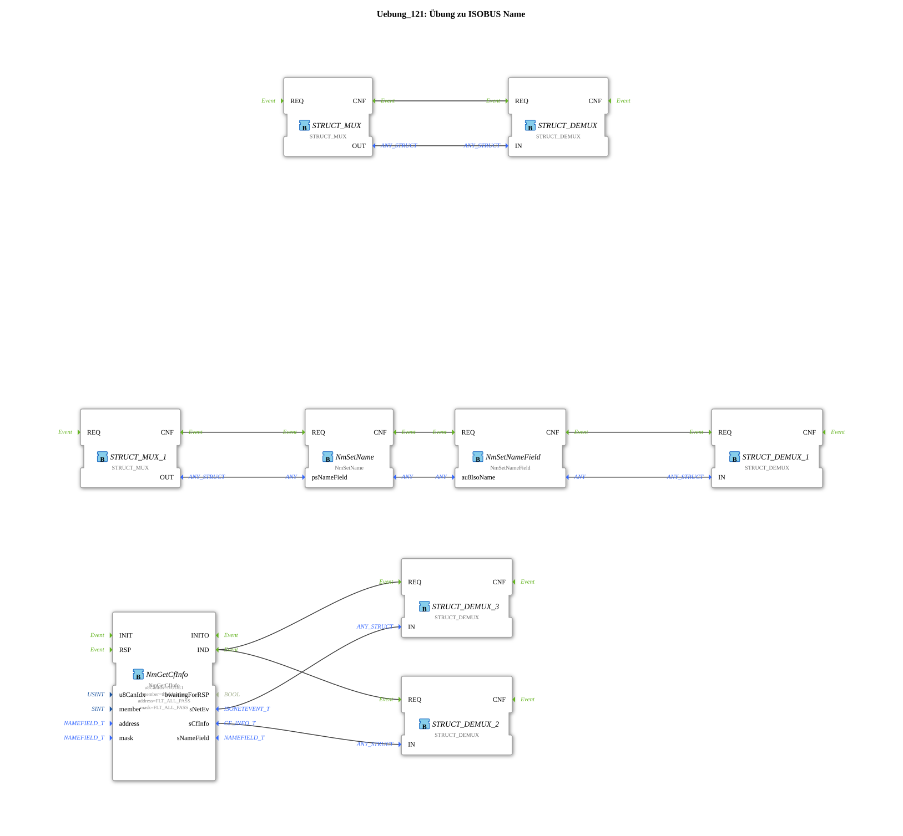

# Exercise_121: ISOBUS Name Exercise

[(https://notebooklm.google.com/notebook/a6872e59-1dfc-4132-a118-aff1bc7bc944)
This article describes the logiBUS® exercise `Uebung_121`.
----
## Overview

[cite_start]This exercise demonstrates the counterpart to 120: Reading the controller's own identity[cite: 1].

The controller returns its own 64-bit name via the parameter `member = thisMember` on the function block `NmGetCfInfo`. The function block `NmSetName` allows the individual fields of the controller's own identity (e.g., the function instance) to be dynamically adjusted at runtime before being communicated over the bus.

