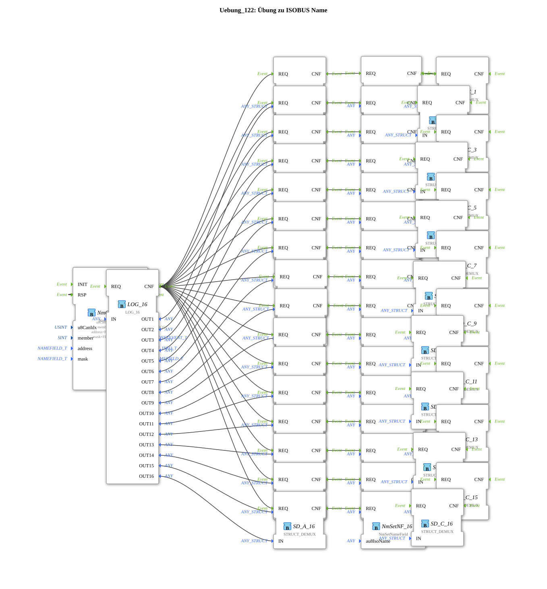

# Exercise_122: ISOBUS Name Exercise

This article describes the logiBUS® exercise `Uebung_122`.
----
## Overview

[cite_start]This exercise demonstrates the detection of a large number of bus participants[cite: 1].

Using the function block `LOG_16`, the names of up to 16 different control functions in the network are buffered and analyzed simultaneously. A detailed identity analysis is performed for each participant using a chain of `NmSetNameField` function blocks. This is a tool for complex diagnostic systems that need to monitor the entire network of devices in a vehicle combination.

