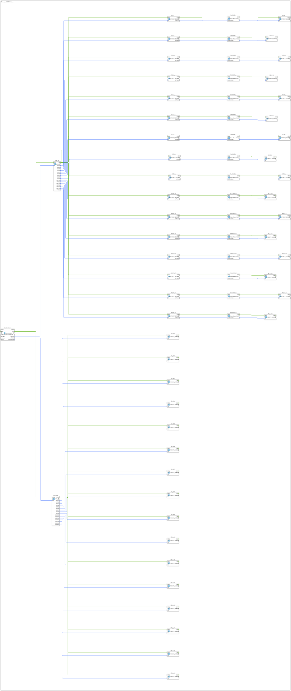

Here is the documentation page for exercise **Exercise_122b** based on the provided XML data.
# Exercise_122b: ISOBUS Name Exercise

* * * * * * * * * *
## Introduction

This exercise ("ISOBUS Name Exercise") deals with the analysis and decoding of the **ISOBUS NAME** field according to ISO 11783. The goal is to retrieve information about participants (Control Functions - CFs) on the bus, extract their 64-bit names, and decompose these names into their individual components (such as manufacturer, device class, function, etc.).

The exercise is implemented as a sub-application (`SubAppType`) and processes lists of network value events and CF information.

## Function Blocks Used (FBs)

In this sub-application, various function blocks are instantiated to implement data processing and visualization.

### Main Blocks:

#### 1. NmGetCfInfo (`isobus::pgn::NmGetCfInfo`)

This block is the starting point of the exercise. It retrieves information about the control functions (CFs) on the network.

- **Parameters**:
- `u8CanIdx` = `NODE1` (CAN node 1)
- `member` = `intern`
- `address` = `FLT_ALL_PASS` (Filter: All addresses)
- `mask` = `FLT_ALL_PASS`
- **Functionality**: It returns arrays of network events (`sNetEv`) and CF information (`sCfInfo`), which are then processed.

#### 2. LOG_16 (`logiBUS::utils::logging::LOG_16`)

Here, two instances (`LOG_16` and `LOG_16B`) are used.

- **Functionality**: In this exercise, these modules serve as array splitters or demultiplexers. They receive the lists (arrays with up to 16 entries) from `NmGetCfInfo` and output the individual elements to 16 separate outputs. This enables the parallel processing of the first 16 detected devices.

#### 3. STRUCT_DEMUX (`eclipse4diac::convert::STRUCT_DEMUX`)

This generic conversion module is widely used (`SD_A_x`, `SD_B_x`, `SD_C_x`) to decompose complex data types (structures) into their individual components so that they can be visualized or further processed.

- **Types Used**:
- `isobus::pgn::ISONETEVENT_T` (in `SD_A_x`): Extracts, among other things, the raw `cfName`.
- `isobus::pgn::CF_INFO_T` (in `SD_B_x`): Displays status information of the conversion module.
- `isobus::pgn::NAMEFIELD_T` (in `SD_C_x`): Displays the decoded fields of the ISOBUS name.

#### 4. NmSetNameField (`isobus::pgn::NmSetNameField`)

This is the core function block for interpreting the name. It occurs 16 times (`NmSetNF_1` to `NmSetNF_16`).

- **Input**: `au8IsoName` (The 64-bit ISOBUS name as a byte array).
- **Functionality**: The function block analyzes the ISOBUS name and decodes it into a structure (`NAMEFIELD_T`) according to the standard. This contains information such as:
- Identity Number
- Manufacturer Code
- ECU Instance
- Function Instance
- Function
- Vehicle System
- Industry Group
- Arbitrary Address Capable

## Program Flow and Connections

The exercise can be divided into three parallel processing paths, triggered by `NmGetCfInfo`:

1. **Acquisition (NmGetCfInfo)**:

This function block scans the bus and outputs the current lists of network participants upon events (`IND`).

2. **Distribution (LOG_16 & LOG_16B)**:

The outputs `sNetEv` (Network Events) and `sCfInfo` (Control Function Info) are passed to the `LOG_16` function blocks. These break down the arrays into individual connections (index 1 to 16).

3. **Processing Path A & C (Name Analysis)**:
- The individual network events are routed from `LOG_16` to the `SD_A` blocks.
- There, the attribute `cfName` (the ISOBUS name) is extracted.
- This `cfName` is then forwarded directly to the respective `NmSetNF` block.
- The `NmSetNF` block decodes the name.
- The result (the structure with the readable fields) is displayed in detail in the `SD_C` block. This allows you to see, for example, which manufacturer is behind a device.
4. **Processing Path B (Information Display)**:
- In parallel, the general CF information is routed from `LOG_16B` to the `SD_B` blocks. This presumably serves to diagnose the addresses and status of the participants, independent of the name decoding.

## Summary

Exercise **Exercise_122b** demonstrates the detailed analysis of ISOBUS participants. By combining list retrieval, demultiplexing, and specific parsing blocks (`NmSetNameField`), it shows how human-readable information such as manufacturer, device class, and function can be extracted from the cryptic 64-bit name of a control unit (ECU). This is essential for diagnostic applications and interoperability in the ISOBUS network.

---

### 🌐 Related topic subpages on ms-muc-docs.de

- [🌐 Eclipse 4diac IDE & Color Reference on ms-muc-docs.de](https://www.ms-muc-docs.de/iec-61499/eclipse-4diac/)

]
