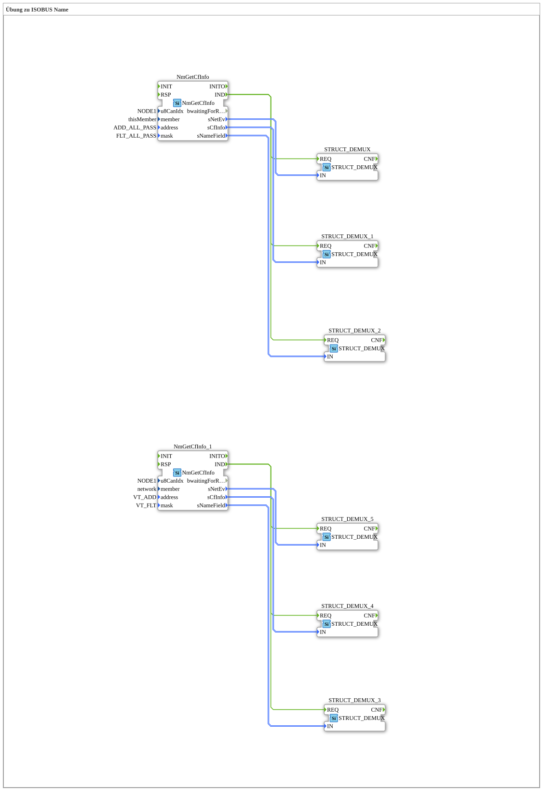

# Exercise_123: ISOBUS Name Exercise

This article describes the logiBUS® exercise `Uebung_123`.
----
## Overview
[cite_start]This section shows how to restrict the network scan to specific device types[cite: 1].

By specifying a target address (`VT_ADD`) and a mask (`VT_FLT`) in the function block `NmGetCfInfo_1`, the program is configured to respond only to devices that match the profile of a "Virtual Terminal" (VT). All other bus participants (e.g., joysticks or task controllers) are ignored by this function block. This allows for a clean separation of communication logic according to functional groups.

