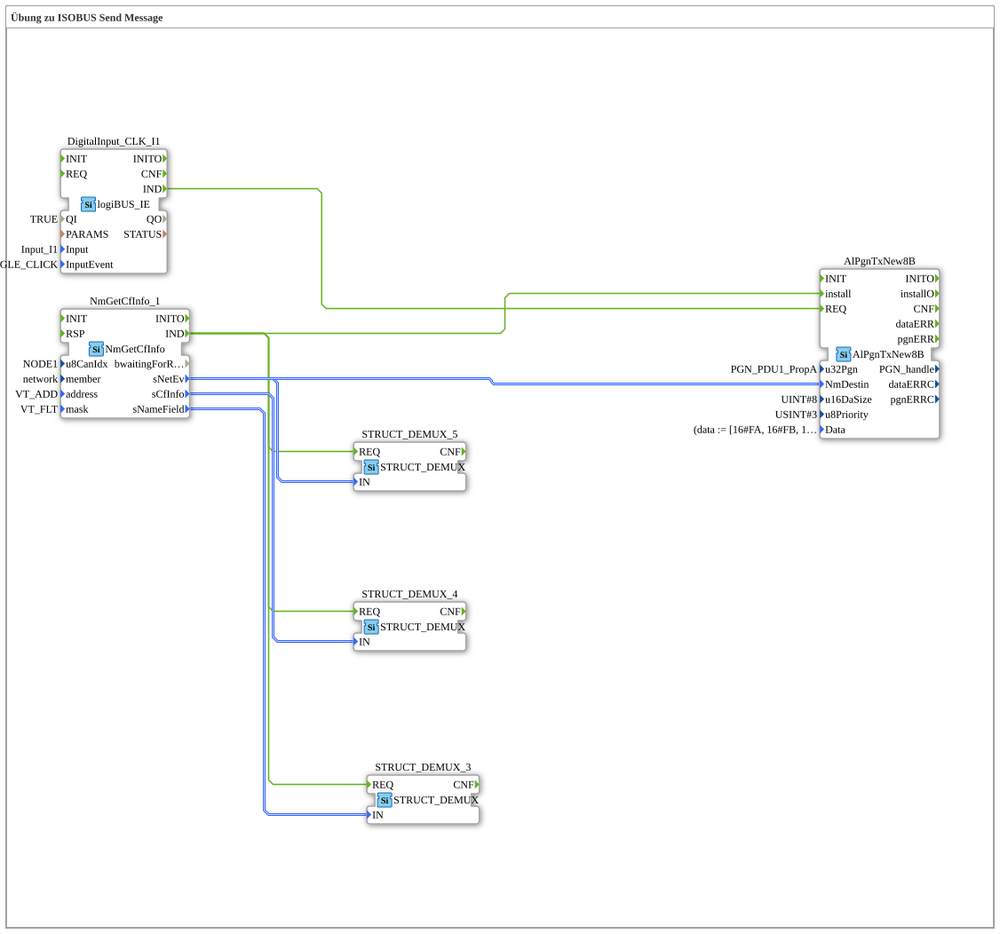

# Exercise_124: ISOBUS Send Message Exercise

This article describes the logiBUS® exercise `Uebung_124`. Here, we move beyond standard messages and send custom data packets (PGNs) to a specific partner in the network.
----
## Objective of the Exercise

Using the function block `AlPgnTxNew8B`. It demonstrates how to define a proprietary message (Proprietary PGN) and send it to a specific ECU.

-----

## Description and Components

[cite_start]The subapplication `Uebung_124.SUB` combines participant search with a send function block[cite: 1].

### Function Blocks (FBs)

* **`NmGetCfInfo_1`**: Searches for the target partner (here, a virtual terminal).
* **`AlPgnTxNew8B`**: The send block for 8-byte messages.
* **Parameters**:
* `u32Pgn`: The message number (here, `61184` = Proprietary A).
* `Data`: The message content (8 bytes of hexadecimal data).

-----

## Functionality

1. First, `NmGetCfInfo` identifies the partner and returns its network identity (`NmDestin`).
2. The `IND` event registers the transmit module once in the system (`install`).
3. Each click of the physical button **I1** now triggers the `REQ` input.
4. The controller then sends the predefined data packet directly to the selected partner.

This forms the basis for manufacturer-specific communication between the tractor and implement.