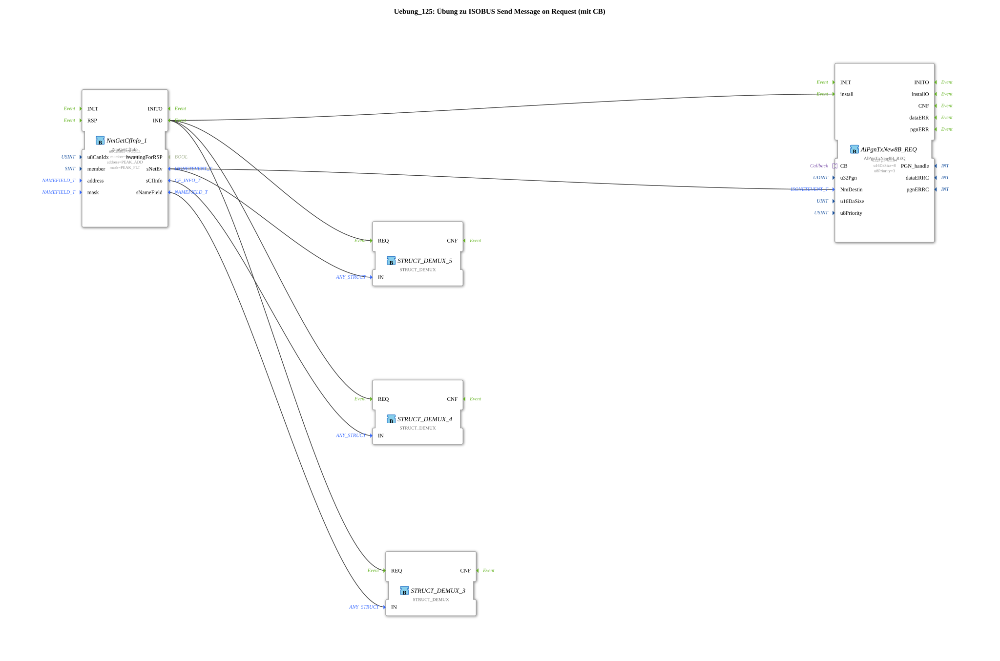

# Exercise_125: ISOBUS Send Message on Request Exercise (with CB)

This article describes the logiBUS® exercise `Uebung_125`.
----
## Overview

[cite_start]Using the function block `AlPgnTxNew8B_REQ` with callback function[cite: 1].

In this exercise, the controller does not send the data itself, but passively waits for a request (ISO Request) from another participant. As soon as a request for the specified PGN (`61184`) arrives, the function block retrieves the current data via the adapter port `CB` (callback) from the sub-application `DataSupply` and automatically sends the response back. This reduces bus load, as data is only transferred when actually needed.

