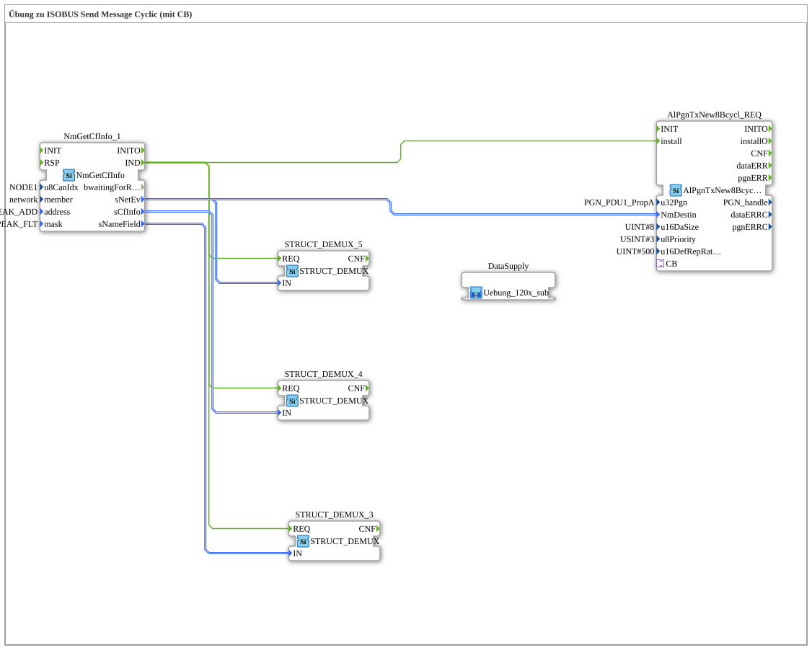

# Exercise_126: ISOBUS Send Message Cyclic Exercise (with CB)

This article describes the logiBUS® exercise `Uebung_126`.
----
## Overview
[cite_start]Using the function block `AlPgnTxNew8Bcycl_REQ`[cite: 1].

Here, the message is repeatedly sent to the bus at a fixed time interval (parameter `u16DefRepRate = 500`ms). The function block also uses the callback mechanism (`CB`) to query the very latest data from the application before each transmission. This is the standard procedure for status messages that must be permanently available (e.g., heart rate or sensor data).

