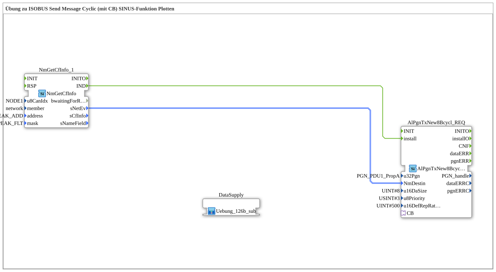

Here is the documentation page for Exercise 126b.
# Exercise_126b: Exercise on ISOBUS Send Message Cyclic (with CB) Plotting a Sine Wave Function

* * * * * * * * * *
## Introduction
Exercise **Exercise_126b** demonstrates the cyclic sending of an ISOBUS message, where the data payload is dynamically generated via a callback mechanism. Specifically, a sine wave function is generated, and its values are written to the first byte of the CAN message. This can be used, for example, to simulate signal waveforms and then plot them in diagnostic tools such as PCAN Explorer.

The key feature of this exercise is the separation of communication management (in the main network) and data generation (in a sub-application), connected via an adapter.

## Function Blocks Used (FBs)

### Main Network
The following function blocks are used in the main network to initiate communication:

* **NmGetCfInfo_1** (`isobus::pgn::NmGetCfInfo`):
* Used to retrieve network information and filter the target address.
* Parameters:
* `u8CanIdx` = `NODE1`
* `member` = `network`
* `address` = `PEAK_ADD`
* `mask` = `PEAK_FLT`
* **AlPgnTxNew8Bcycl_REQ** (`isobus::pgn::tx::AlPgnTxNew8Bcycl_REQ`):
* This function block is responsible for cyclically sending an 8-byte message.
* It has an adapter port (`CB`) through which the data request (callback) is handled.
* * Parameters:
* `u32Pgn` = `61184` (The parameter group number used)
* `u16DaSize` = `8` (Data length in bytes)
* `u8Priority` = `3` (Message priority)
* `u16DefRepRate` = `500` (Cycle time in milliseconds)
* **DataSupply** (`Uebungen::Uebung_126b_sub`):
* A sub-application containing the logic for data generation (sine curve).
* ### Sub-Blocks: DataSupply (Exercise_126b_sub)

This sub-application encapsulates the logic for calculating sine values.

* **Type**: SubApp
* **Internal Function Blocks Used**:
* **Callback Function Block**: `isobus::pgn::tx::CallbackFB`
* This block serves as an interface to the cyclic transmitter. When the transmitter requires data, this function block triggers the calculation chain.
* Parameter: `DI1` (Input for the calculated data structure)
* **GEN_SIN**: `OSCAT::Basic::POUs::Engineering::signal_generators::GEN_SIN`
* Generates a sinusoidal signal.
* Parameters:
* `PT` = `T#10s` (Period)
* `AM` = `10.0` (Amplitude)
* `OS` = `5.0` (Offset)
* `DL` = `0.0`
* **F_LREAL_TO_USINT**: `iec61131::conversion::F_LREAL_TO_USINT`
* Converts the floating-point value of the sine generator to an unsigned small integer (USINT).
* Converts the floating-point value of the sine generator to an unsigned small integer (USINT). * **F_USINT_TO_BYTE**: `iec61131::conversion::F_USINT_TO_BYTE`
* Converts the USINT value to a byte.
* **BYTES_TO_ARR08B**: `logiBUS::utils::conversion::arr::reversing::BYTES_TO_ARR08B`
* Creates a byte array of 8 individual bytes.
* The calculated sine value is assigned to `IN_00`.
* Parameters `IN_01` to `IN_07` are statically assigned to `16#00`.
* **STRUCT_MUX**: `eclipse4diac::convert::STRUCT_MUX`
* Wraps the byte array in the structure `isobus::pgn::CAN_MSG`.
* Attribute: `StructuredType` = `isobus::pgn::CAN_MSG`
* **Functionality**:

As soon as `CallbackFB` receives an event (triggered by the cyclic transmitter in the main program), it activates `GEN_SIN`. The current sine wave value is calculated, converted (LREAL -> USINT -> BYTE), and written to the first byte of an array. This array is packaged into a CAN message structure and sent back to the main program via `CallbackFB`.

## Program Flow and Connections

1. **Initialization**: The `NmGetCfInfo_1` module determines the necessary network information at startup.

2. **Configuration**: As soon as the network information is available (`IND` event), the transmitter module `AlPgnTxNew8Bcycl_REQ` is installed (`install`).

3. **Cyclic Operation**:

* The `AlPgnTxNew8Bcycl_REQ` module is set to a repetition rate of 500 ms.
* Every 500 ms, it triggers a request via the adapter port `CB` (connected to `DataSupply.PLUG1`).

4. **Data Processing**:

* Within the sub-application `DataSupply`, the `CallbackFB` receives the request.
* This triggers the signal chain: The sine wave generator `GEN_SIN` calculates the next value based on the current time.
* Due to the parameters (amplitude 10, offset 5), the generator produces values in the range of -5.0 to +15.0. Since the conversion is performed on `USINT`, negative values are typically clipped to 0.

5. **Return and Sending**:

* The calculated value is placed in the first byte of the payload.
* The data is sent back to `AlPgnTxNew8Bcycl_REQ` via the adapter.
* The module sends PGN 61184 with the current data to the CAN bus.

**Learning Objectives:**

* Understanding the adapter concept (plugs/sockets) in 4diac.
* * Use of callback mechanisms for just-in-time data generation with cyclic transmitters.
* Use of OSCAT library blocks (`GEN_SIN`) for signal simulation.
* Data conversion and structuring for ISOBUS/CAN messages.

## Summary
Exercise 126b demonstrates an elegant method for sending simulation data (here, a sine wave) via ISOBUS. By outsourcing data generation to a sub-application and using the callback interface, the main application remains uncluttered, and the cyclic transmitter autonomously handles the timing, while the current data is recalculated fresh with each cycle. The result can be visualized as a waveform in the PCAN Explorer (byte 0 of the message).

---

### 🌐 Related topic subpages on ms-muc-docs.de
* [🌐 Eclipse 4diac IDE & Color Reference on ms-muc-docs.de](https://www.ms-muc-docs.de/iec-61499/eclipse-4diac/)

]