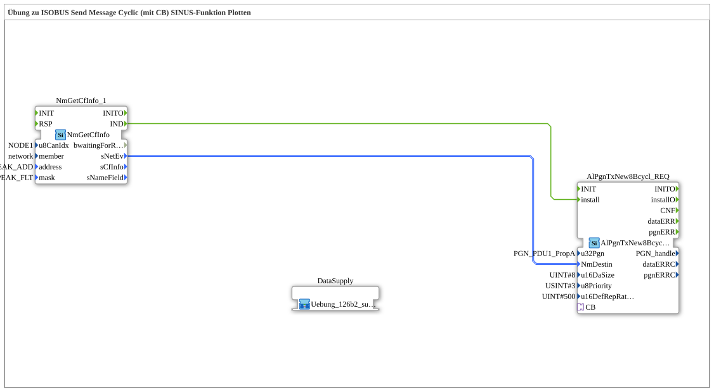

Here is the documentation for exercise **Exercise_126b2** based on the provided data.
# Exercise_126b2: ISOBUS Send Message Cyclic (with CB) Sine Function Plotting

* * * * * * * * * *
## Introduction

This exercise demonstrates the cyclic sending of an ISOBUS message whose data content is dynamically generated at runtime. Specifically, a sine function is generated, its values are packaged into a CAN message, and sent over the network. This is suitable, for example, for plotting signals in PCAN Explorer.

A special feature of this exercise is the use of the **callback mechanism**. Instead of providing the data statically, the send block (`AlPgnTxNew8Bcycl_REQ`) requests new data via an adapter connection (`CB`) shortly before the packet is sent.

## Function Blocks (FBs) Used

The following blocks are used in the main application to initiate network communication and control the sending process:

* **NmGetCfInfo_1** (`isobus::pgn::NmGetCfInfo`):
* This block retrieves necessary network information (e.g., source address) for a specific node (`NODE1`).
* It filters for specific parameters (`PEAK_ADD`, `PEAK_FLT`).
* **AlPgnTxNew8Bcycl_REQ** (`isobus::pgn::tx::AlPgnTxNew8Bcycl_REQ`):
* This function block is responsible for cyclically sending the message.
* **Parameters**:
* `u32Pgn`: 61184 (The target PGN).
* `u16DaSize`: 8 (Data length in bytes).
* `u8Priority`: 3 (Message priority).
* `u16DefRepRate`: 500 (Repeat rate in milliseconds).

### Sub-function block: DataSupply (Exercise_126b2_sub)

The actual data generation takes place in an encapsulated sub-function block.

* **Type**: `Uebung_126b2_sub`
* **Description**: Generates a sine function and makes it available via a callback interface.
* **Internal Function Blocks Used**:
* **GEN_SIN**: `OSCAT::Basic::POUs::Engineering::signal_generators::GEN_SIN`
* Used to generate the sine wave signal.
* * Parameters:
* `PT` (Period) = `T#10s`
* `AM` (Amplitude) = `10.0`
* `OS` (Offset) = `5.0`
* **F_REAL_TO_DWORD**: `iec61131::conversion::F_REAL_TO_DWORD`
* Converts the sine wave generator's `REAL` value to `DWORD`.
* Converts the sine wave generator's `REAL` value to `DWORD`. * **BYTES_TO_ARR08B**: `logiBUS::utils::conversion::arr::reversing::DWORDS_TO_ARR08B`
* Converts the `DWORD` format into a byte array required for the CAN message.
* **STRUCT_MUX**: `eclipse4diac::convert::STRUCT_MUX`
* Creates the structure `isobus::pgn::CAN_MSG` from the converted data.
* **CallbackFB**: `isobus::pgn::tx::CallbackFB`
* Establishes the connection to the adapter `PLUG1` and triggers the calculation when the transmit block requests data.
* **Functionality**:

As soon as the transmit block in the main network is ready to send, it triggers `CallbackFB` via the adapter. This module (`REQ`) requests the next value from `GEN_SIN`. The calculated sine value is converted, decomposed into a byte array, and packaged into a CAN message structure. This structure is then sent back to the transmitting module via the adapter.

## Program Flow and Connections

1. **Initialization**:
* First, module `NmGetCfInfo_1` is executed to load the network configuration for `NODE1`.
* Once the information is available (`IND` event), the cyclic transmitter `AlPgnTxNew8Bcycl_REQ` is initialized via the input `install`.
2. **Cyclic Transmission**:
* The `AlPgnTxNew8Bcycl_REQ` is set to a cycle time of **500 ms**.
* The transmission process is initiated every 500 ms.
3. **Data Generation (Callback)**:
* The transmitter is connected to the sub-module `DataSupply` via an adapter connection (`CB`, <->, `PLUG1`).
* Before transmission, the transmitter calls the sub-module.
* The sub-module calculates the current value of the sine wave (period 10s, amplitude 10, offset 5).
* The value is converted into the appropriate data format (array of bytes) and returned.
* 4. **Output**:
* The PGN 61184 is written to the bus with the current sine wave data. External tools (such as PCAN Explorer) can visualize this data.

## Summary

This exercise demonstrates how to create ISOBUS applications in 4diac that calculate data dynamically at runtime, not just statically. By using the callback pattern, an efficient separation between communication management (cyclic sending) and application logic (signal generation) is achieved. The result is a sine wave visible on the CAN bus.

---

### 🌐 Related topic subpages on ms-muc-docs.de

* [🌐 Eclipse 4diac IDE & color reference on ms-muc-docs.de](https://www.ms-muc-docs.de/iec-61499/eclipse-4diac/)

]
