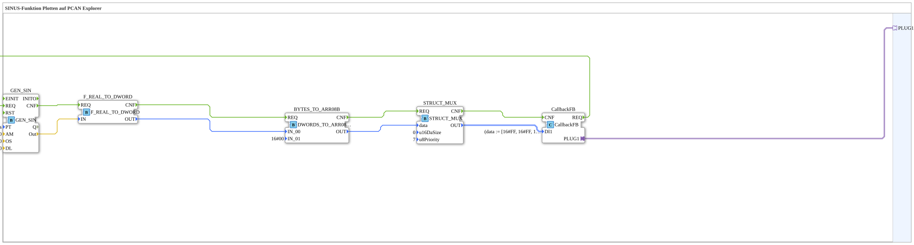

# Exercise_126b2_sub: Plotting a Sine Wave Function on PCAN Explorer

* * * * * * * * * *
## Introduction

This exercise demonstrates how to generate a sine wave function using 4diac and CAN communication and send it to a PCAN Explorer via the CAN bus. The generated sine wave value is converted into a byte array, packaged into a CAN message, and sent via a callback mechanism. The goal is to display the sinusoidal output on the PCAN Explorer.
## Function Blocks Used

This exercise uses the following function blocks within the sub-application sub-block `Uebung_126b2_sub`:

- **GEN_SIN** (Type: `OSCAT::Basic::POUs::Engineering::signal_generators::GEN_SIN`)

Generates a sinusoidal waveform.

- Parameters:
- `PT` = T#10s (Period duration 10 seconds)
- `AM` = 10.0 (Amplitude)
- `OS` = 5.0 (Offset)
- `DL` = 0.0 (Delay)
- Event output `CNF` signals calculation complete.
- Data output `Out` returns the current sine value (REAL).
- **F_REAL_TO_DWORD** (Type: `iec61131::conversion::F_REAL_TO_DWORD`)

Converts the REAL sine value to a DWORD (32-bit).

- Event input `REQ`, output `CNF`.
- Data input `IN`, data output `OUT`.
- **BYTES_TO_ARR08B** (Type: `logiBUS::utils::conversion::arr::reversing::DWORDS_TO_ARR08B`)

Converts a DWORD to an 8-byte array (reverse byte order).

- Parameter: `IN_01` = 16#00 (second DWORD set to zero, as only one DWORD is processed).
- Data input `IN_00` receives the converted DWORD from `F_REAL_TO_DWORD`.
- Data output `OUT` returns the byte array.
- **STRUCT_MUX** (Type: `eclipse4diac::convert::STRUCT_MUX`)

Constructs a structure of type `isobus::pgn::CAN_MSG` from the input data.

- Parameters:
- `StructuredType` = `isobus::pgn::CAN_MSG`
- `u16DaSize` = 0 (Length field)
- `u8Priority` = 7 (CAN priority)
- Event input `REQ`, output `CNF`.
- Data input `data` receives the byte array from `BYTES_TO_ARR08B`.
- Data output `OUT` delivers the completed CAN message.
- **CallbackFB** (Type: `isobus::pgn::tx::CallbackFB`)

Sends the CAN message to the PCAN Explorer via the adapter `PLUG1`.

- Parameter: `DI1` = `(data := [16#FF, 16#FF, ...])` (this value is overwritten by the connection of `STRUCT_MUX.OUT`).
- Event input `CNF` triggers transmission.
- Output `REQ` (trigger for the next cycle).
- Adapter output `PLUG1` connects to the outer plug.

## Program Flow and Connections

The flow is cyclical and controlled by event chaining:

1. **Start**: The block `CallbackFB` sends a `REQ` event to `GEN_SIN`.
2. **Sine Generation**: `GEN_SIN` calculates the current sine value and sends `CNF` to `F_REAL_TO_DWORD`.
3. **Type Conversion**: `F_REAL_TO_DWORD` converts the REAL value to a DWORD and sends `CNF` to `BYTES_TO_ARR08B`.
4. **Byte Conversion**: `BYTES_TO_ARR08B` splits the DWORD into 8 bytes (inverting big-endian) and sends `CNF` to `STRUCT_MUX`.
5. **Structure Construction**: `STRUCT_MUX` packs the byte array into a `CAN_MSG` structure and sends `CNF` to `CallbackFB`.
6. **Send**: `CallbackFB` sends the CAN message via the adapter `PLUG1` and then triggers `GEN_SIN` again (via `REQ`), thus restarting the cycle.

The data connections transmit the corresponding values:

- `GEN_SIN.Out` → `F_REAL_TO_DWORD.IN`
- `F_REAL_TO_DWORD.OUT` → `BYTES_TO_ARR08B.IN_00`
- `BYTES_TO_ARR08B.OUT` → `STRUCT_MUX.data`
- `STRUCT_MUX.OUT` → `CallbackFB.DI1`

**Learning Objectives**:

- Understanding signal generation with `GEN_SIN`.
- Working with type conversions (REAL → DWORD → Byte Array).
- Constructing a CAN message with `STRUCT_MUX`.
- Integration of CAN communication via `CallbackFB`.

**Difficulty Level**: Medium.

**Prerequisites**: Basic knowledge of the 4diac IDE, fundamental understanding of CAN bus and signal processing.

## Summary

This exercise implements cyclic sine wave generation and sends the values to a PCAN Explorer via CAN bus. By chaining several function blocks, the entire path from the analog signal to the serial CAN message is mapped. The sub-block `Uebung_126b2_sub` encapsulates this logic and can be reused in higher-level applications.

--

### 🌐 Related topic subpages on ms-muc-docs.de

- [🌐 Eclipse 4diac IDE & color reference on ms-muc-docs.de ](https://www.ms-muc-docs.de/iec-61499/eclipse-4diac/)

]
