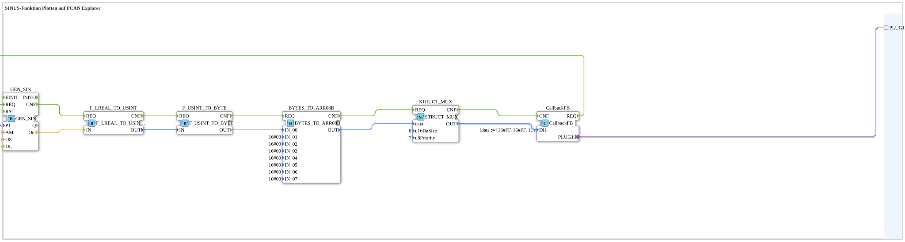

# Exercise_126b_sub: Plotting a Sine Wave Function on PCAN Explorer

* * * * * * * * * *
## Introduction
This exercise demonstrates the generation of a sine wave signal using the function block `GEN_SIN` and the preparation of the data for transmission via the CAN bus. The generated values are converted into a message format suitable for PCAN Explorer and sent to the adapter `isobus::pgn::tx::Callback` via a callback function block. The goal is to understand signal generation, type conversion, and the structuring of CAN messages in the 4diac IDE.
## Function Blocks Used

| FB Name | Type | Important Parameters | Short Description |

|-------------------|---------------------------------------------------------------------|------------------------------------------------------------------------------------|----------------------------------------------------------------------------------|

| `GEN_SIN` | OSCAT::Basic::POUs::Engineering::signal_generators::GEN_SIN | PT = T#10s, AM = 10.0, OS = 5.0, DL = 0.0 | Generates a sine wave with a period of 10 s, amplitude 10, and offset 5. |

| `F_LREAL_TO_USINT`| iec61131::conversion::F_LREAL_TO_USINT | – | Converts the floating-point value (`LREAL`) to an unsigned 8-bit value (`USINT`). |
| `F_USINT_TO_BYTE` | iec61131::conversion::F_USINT_TO_BYTE | – | Converts `USINT` to `BYTE`. |

| `BYTES_TO_ARR08B` | logiBUS::utils::conversion::arr::reversing::BYTES_TO_ARR08B | IN_01 … IN_07 = 16#00 (initial values) | Builds an 8-byte array from a `BYTE` value (IN_00) and seven additional bytes (reversing the order). |

| `STRUCT_MUX` | eclipse4diac::convert::STRUCT_MUX | StructuredType = "isobus::pgn::CAN_MSG", u16DaSize = 0, u8Priority = 7 | Assembles the received data into a CAN message structure (`CAN_MSG`). |

| `CallbackFB` | isobus::pgn::tx::CallbackFB | DI1 = (data := [16#FF, 16#FF, …]) (Initial Dummy) | Sends the completed CAN message to the PCAN Explorer via the adapter `PLUG1`. |

## Program Flow and Connections

The entire processing chain is started by the event `CallbackFB.REQ`. The data then goes through the following steps:

1. **Signal Generation**

`GEN_SIN` calculates a new sine wave value and outputs it via the data output `Out`. Simultaneously, the event `CNF` is sent.

2. **Type Conversion LREAL → USINT**

The output `GEN_SIN.Out` is connected to `F_LREAL_TO_USINT.IN`. The function block `F_LREAL_TO_USINT` is activated by the event `CNF` from `GEN_SIN` and converts the value. Its data output `OUT` feeds the next function block.

3. **Type Conversion USINT → BYTE**

`F_USINT_TO_BYTE` receives the value `USINT` and outputs a value `BYTE`. The event sequence is: `GEN_SIN.CNF` → `F_LREAL_TO_USINT.REQ` → `F_LREAL_TO_USINT.CNF` → `F_USINT_TO_BYTE.REQ`.

4. **Byte Array Assembly**

The value `BYTE` is connected to `BYTES_TO_ARR08B.IN_00`. The remaining inputs (`IN_01 … IN_07`) are set to `16#00`. The module generates an 8-byte array (in reverse order) and signals this with `CNF`.

5. **Structuring for the CAN Message**

`STRUCT_MUX` is triggered by the event of `BYTES_TO_ARR08B.CNF`. It constructs a CAN message of type `isobus::pgn::CAN_MSG` from the received data array (input `data`) and the predefined parameters (`u8Priority = 7`, `u16DaSize = 0`). The structured output `OUT` is forwarded to `CallbackFB.DI1`.

6. **Sending via CAN**

`CallbackFB` receives the event `CNF` from `STRUCT_MUX` and sends the message via the adapter `PLUG1` to the PCAN Explorer. The next event is then triggered via `CallbackFB.REQ`, and the cycle begins again.

The event and data connections are implemented in the subapp diagram as follows (simplified representation):

CallbackFB.REQ  →  GEN_SIN.REQ
GEN_SIN.CNF     →  F_LREAL_TO_USINT.REQ
F_LREAL_TO_USINT.CNF  →  F_USINT_TO_BYTE.REQ
F_USINT_TO_BYTE.CNF   →  BYTES_TO_ARR08B.REQ
BYTES_TO_ARR08B.CNF   →  STRUCT_MUX.REQ
STRUCT_MUX.CNF        →  CallbackFB.CNF
Data Flows:

`GEN_SIN.Out` → `F_LREAL_TO_USINT.IN` → `OUT` → `F_USINT_TO_BYTE.IN` → `OUT` → `BYTES_TO_ARR08B.IN_00` → `OUT` → `STRUCT_MUX.data` → `OUT` → `CallbackFB.DI1`

## Summary

This exercise illustrates the entire path from analog signal generation to the output of a CAN message. Data types are converted step by step, a byte array is built, and it is packaged into a standardized CAN structure. By linking event and data flows, a periodic, cyclical process is achieved, making it ideal for visualization or control via the PCAN Explorer.

---

### 🌐 Related topic subpages on ms-muc-docs.de
* [🌐 Eclipse 4diac IDE & Color Reference on ms-muc-docs.de](https://www.ms-muc-docs.de/iec-61499/eclipse-4diac/)

]
