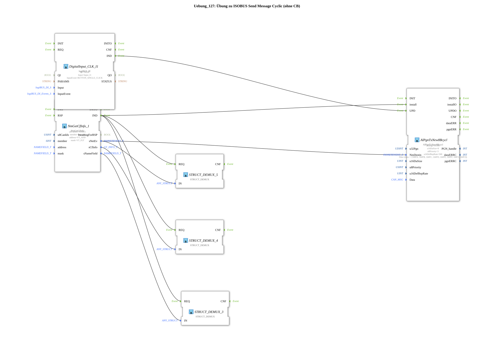

# Exercise_127: ISOBUS Send Message Cyclic Exercise (without Callback)

[(https://notebooklm.google.com/notebook/a6872e59-1dfc-4132-a118-aff1bc7bc944)
This article describes the logiBUS® exercise `Uebung_127`
----

## Overview

[cite_start]Variant of cyclic sending using `AlPgnTxNew8Bcycl` without a callback[cite: 1].

In this exercise, the data to be sent is stored as parameters in the function block. However, an event at the input `UPD` (Update) allows the application to change the message content as needed. This is a simpler alternative to a callback if the data does not change in every cycle.

