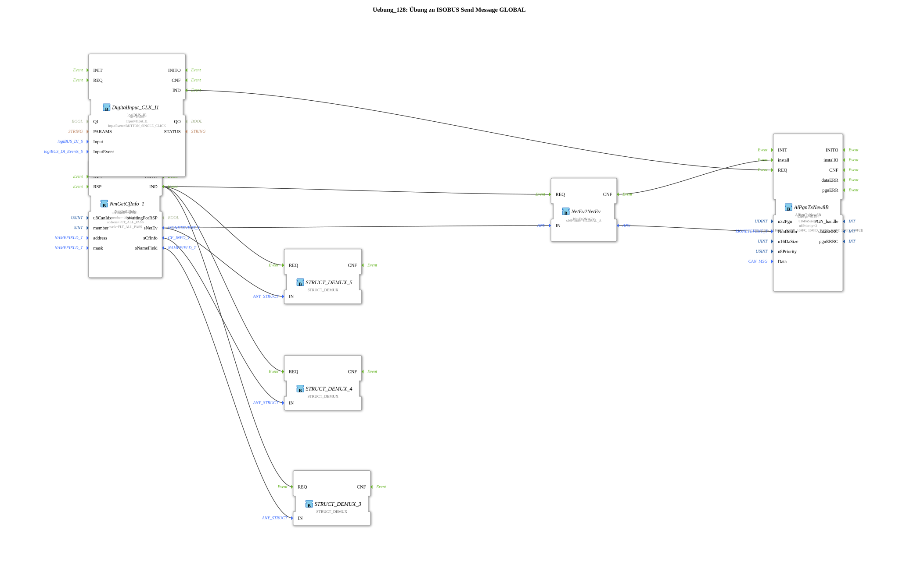

# Exercise_128: ISOBUS Send Message GLOBAL Exercise

This article describes the logiBUS® exercise `Uebung_128`.
----
## Overview

[cite_start]In this exercise, a message is sent to all participants in the network simultaneously (broadcast)[cite: 1].

For this purpose, the function block `NetEv2NetEv` with the special handle `GLOBAL_A` (address 255) is used. The resulting network identity is used as the destination (`NmDestin`) for the send function block. A message sent in this way is received by every device on the ISOBUS and can be used for general information or synchronization signals.

