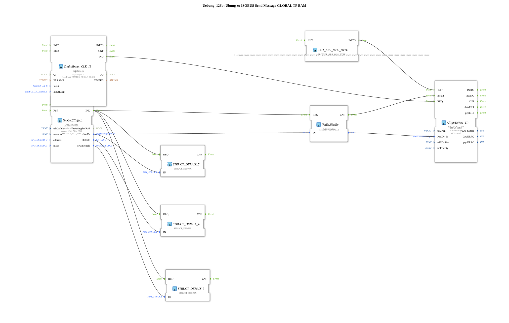

Here is the documentation for exercise `Uebung_128b` based on the provided data.
# Exercise_128b: ISOBUS Send Message GLOBAL TP BAM

* * * * * * * * * *
## Introduction
This exercise demonstrates sending an ISOBUS message using the **Transport Protocol (TP)** with the **Broadcast Announce Message (BAM)** method. A message is sent to the global address (Broadcast). Since the data size exceeds 8 bytes (here 32 bytes), the use of the Transport Protocol is necessary.

## Function Blocks (FBs) Used

In this exercise, various function blocks are interconnected to implement network communication and data generation.

### Main Components
* **isobus::pgn::NmGetCfInfo** (`NmGetCfInfo_1`)
* This function block retrieves information about a Control Function (CF) on the network.

### Main Components
* **isobus::pgn::NmGetCfInfo** (`NmGetCfInfo_1`)
* This function block retrieves information about a Control Function (CF) on the network. * **Parameters**:
* `u8CanIdx`: `NODE1` (CAN node 1)
* `member`: `thisMember` (Refers to the local participant)
* `address`, `mask`: `FLT_ALL_PASS` (Filter settings)
* **Function**: It provides network events (`sNetEv`) and name information required for initializing the transmit module.
* **isobus::pgn::NetEv2NetEv** (`NetEv2NetEv`)
* A converter block that processes network events and assigns destination addresses.
* **Parameters**:
* `s16Handle`: `GLOBAL_A` (Defines the destination as a global address/broadcast).
* **Function**: It converts the network event of the local device into an event configured for global transmission (broadcast).
* **isobus::pgn::tx::AlPgnTxNew_TP** (`AlPgnTxNew_TP`)
* The actual send block for PGNs using the Transport Protocol (TP).
* * **Parameters**:
* `u32Pgn`: `61184` (Proprietary A PGN).
* `u16DaSize`: `0` (Dynamic overwrites).
* `u8Priority`: `3`.
* **Inputs**:
* `NmDestin`: Receives the destination information (Global) from `NetEv2NetEv`.
* `Data`: Receives the 32-byte payload.
* `install`: Initializes the send handle.
* `REQ`: Triggers sending.
* **logiBUS::io::DI::logiBUS_IE** (`DigitalInput_CLK_I1`)
* Processes digital input signals.
* **Parameters**:
* `Input`: `Input_I1`
* `InputEvent`: `BUTTON_SINGLE_CLICK`
* **Function**: Serves as a trigger for the sending process.
* **eclipse4diac::convert::providers::PROVIDE_ARR_0032_BYTE** (`INIT_ARR_0032_BYTE`)
* Creates a static byte array.
* **Parameters**:
* `D1`: A 32-byte array (starting with `16#01, 16#00... 16#AA...`).
* **Function**: Provides the payload for the ISOBUS message.

### Debugging / Visualization
The following blocks are used to break down structures for diagnostic purposes:

* **eclipse4diac::convert::STRUCT_DEMUX** (`STRUCT_DEMUX_3`): Parses `isobus::pgn::NAMEFIELD_T`.
* **eclipse4diac::convert::STRUCT_DEMUX** (`STRUCT_DEMUX_4`): Parses `isobus::pgn::CF_INFO_T`.
* **eclipse4diac::convert::STRUCT_DEMUX** (`STRUCT_DEMUX_5`): Parses `isobus::pgn::ISONETEVENT_T`.

## Program Flow and Connections

The exercise proceeds as follows:

1. **Initialization**:

* The block `NmGetCfInfo_1` provides information about its own network node. The `IND` event triggers the subsequent steps.
* The network information (`sNetEv`) is forwarded to `NetEv2NetEv`.
* Simultaneously, `INIT_ARR_0032_BYTE` provides a 32-byte data packet and initializes the data input of `AlPgnTxNew_TP`.
* 2. **Sender Configuration**:
* The block `NetEv2NetEv` is configured with the handle `GLOBAL_A`. This means it prepares the send block to send to the global address (255).
* The result of `NetEv2NetEv` is placed at the input `NmDestin` of `AlPgnTxNew_TP` and acknowledged via the event `install`. This tells the sender to send a broadcast telegram.
* 3. **Transmitting Process (TP BAM)**:
* Pressing the button `Input_I1` (single click) on the module `DigitalInput_CLK_I1` triggers the event `REQ` on the transmitting module `AlPgnTxNew_TP`.
* Since the data length (32 bytes) is greater than 8 bytes and the destination is the global address, the module automatically uses the **BAM protocol** (Broadcast Announce Message) to transmit the data in segments.
* The PGN 61184 (Proprietary A) is transmitted with priority 3.

## Summary

This exercise provides a deeper understanding of how to use ISOBUS transport protocols. Specifically, this section demonstrates how to send larger data sets (> 8 bytes) to all participants in the network (broadcast) using `AlPgnTxNew_TP`. The combination of the PGN configuration, the data source (`INIT_ARR`), and the addressing (`GLOBAL_A`) leads to the automatic negotiation of a BAM transmission.

---

### 🌐 Related topic subpages on ms-muc-docs.de
* [🌐 Eclipse 4diac IDE & color reference on ms-muc-docs.de ](https://www.ms-muc-docs.de/iec-61499/eclipse-4diac/)

]