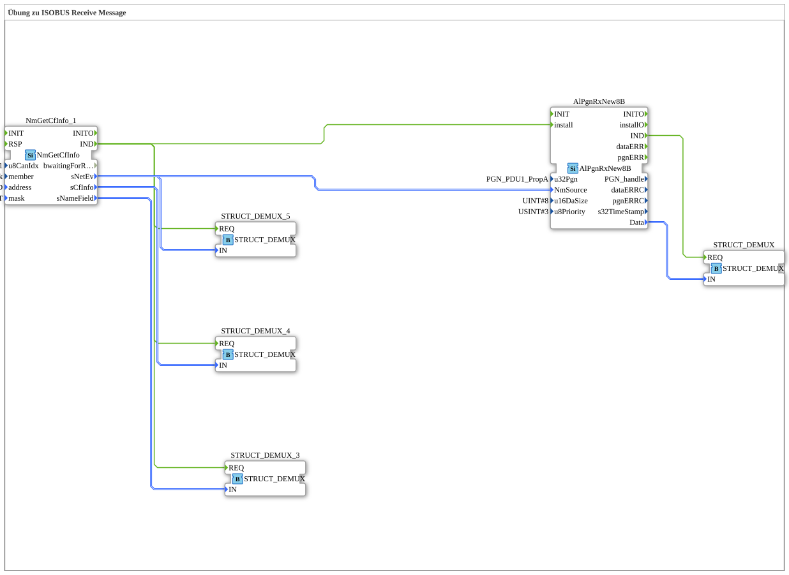

# Exercise_130: ISOBUS Receive Message Exercise

This article describes the logiBUS® exercise `Uebung_130`. It demonstrates the counterpart to sending: the targeted reception of manufacturer-specific messages.
----
## Objective of the Exercise

Using the function block `AlPgnRxNew8B`. It demonstrates how to listen for a specific message (PGN) from a particular partner and evaluate its content for your own program.

-----

## Description and Components

[cite_start]In `Uebung_130.SUB`, a receive filter for a manufacturer-specific PGN is configured[cite: 1].

### Function Blocks (FBs)

* **`NmGetCfInfo_1`**: Identifies the message sender (source).
* **`AlPgnRxNew8B`**: The receive block. It filters all CAN messages and only allows the matching PGN to pass through.
* **`STRUCT_DEMUX`**: Splits the received 8-byte message back into individual signals.

-----

## Functionality

1. The block is registered in the system via `install` and linked to the desired sender (`NmSource`).
2. As soon as the partner sends the matching message (PGN `61184`), the block recognizes this.
3. It fires the event `IND` (Indication) and makes the data packet available on port `Data`.
4. The demultiplexer allows the program to now respond to the message content.

This enables private communication between two specific devices on the bus without interfering with other participants.