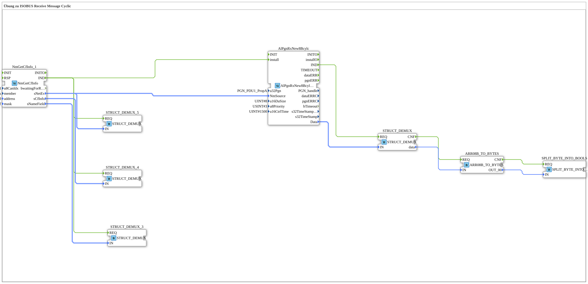

# Exercise_131: ISOBUS Receive Message Cycle Exercise

[(https://notebooklm.google.com/notebook/a6872e59-1dfc-4132-a118-aff1bc7bc944)
This article describes the logiBUS® exercise `Uebung_131`. Here, message reception is enhanced with a timeout monitoring feature.

## 🎧 Podcast

- [The three timers of DIN EN 61131-3 decoded – TP, TON & TOF explained precisely](https://podcasters.spotify.com/pod/show/iec-61499-grundkurs-de/episodes/Die-drei-Timer-der-DIN-EN-61131-3-entschlsselt--TP--TON--TOF-przise-erklrt-e3dma77)
- [DIN EN 61131-3 vs. 61499-1: Your guide through the standards of industrial automation](https://podcasters.spotify.com/pod/show/iec-61499-grundkurs-de/episodes/DIN-EN-61131-3-vs--61499-1-Dein-Wegweiser-durch-die-Normen-der-Industrieautomatisierung-e36c6nc)
- [DIN EN 61131-3: The heart of agricultural and construction machinery mechatronics and the leap into the future with OB](https://podcasters.spotify.com/pod/show/iec-61499-grundkurs-de/episodes/DIN-EN-61131-3-Das-Herz-der-Land--und-Baumaschinen-Mechatronik-und-der-Sprung-in-die-Zukunft-mit-Ob-e36c2mp)
- [FB_TOF and E_TOF: Delay timers in IEC 61131-3 and 61499](https://podcasters.spotify.com/pod/show/iec-61499-grundkurs-de/episodes/FB_TOF-und-E_TOF-Verzgerungstimer-in-IEC-61131-3-und-61499-e368e2d)
- [IEC 61499 vs. 61131: Do we need a new standard for IIoT? Analysis of a Heated Debate on Distributed Intelligence](https://podcasters.spotify.com/pod/show/iec-61499-grundkurs-de/episodes/IEC-61499-vs--61131-Brauchen-wir-einen-neuen-Standard-fr-IIoT--Analyse-einer-hitzigen-Debatte-um-Verteilte-Intelligenz-e3ahc2r)

----

## Overview

[cite_start]Using the `AlPgnRxNew8Bcylc` block[cite: 1].

This block is specifically designed for messages that are expected regularly (cyclically). A check time is defined via the parameter `u16CtrlTime = 1500`ms. If the partner does not send a message for more than 1.5 seconds, this is considered a communication interruption. The application can react to this error to bring the machine to a safe state.
