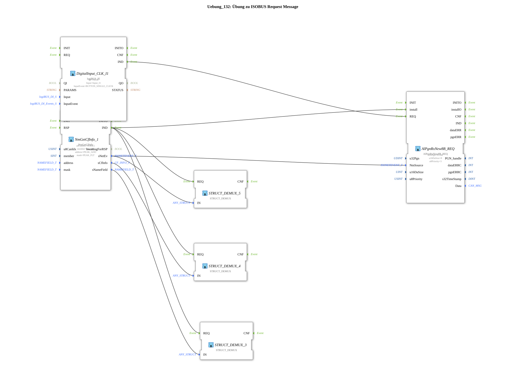

# Exercise_132: ISOBUS Request Message Exercise

This article describes the logiBUS® exercise `Uebung_132`.

----

## Overview

[cite_start]This exercise uses the function block `AlPgnRxNew8B_REQ`[cite: 1].

Instead of passively waiting for a message, the controller can actively send a request for a specific PGN to the partner. A click on button **I1** triggers the `REQ` event, whereupon the controller sends the corresponding request message to the bus. As soon as the partner responds, this is considered a regular receipt (`IND`) and processed.