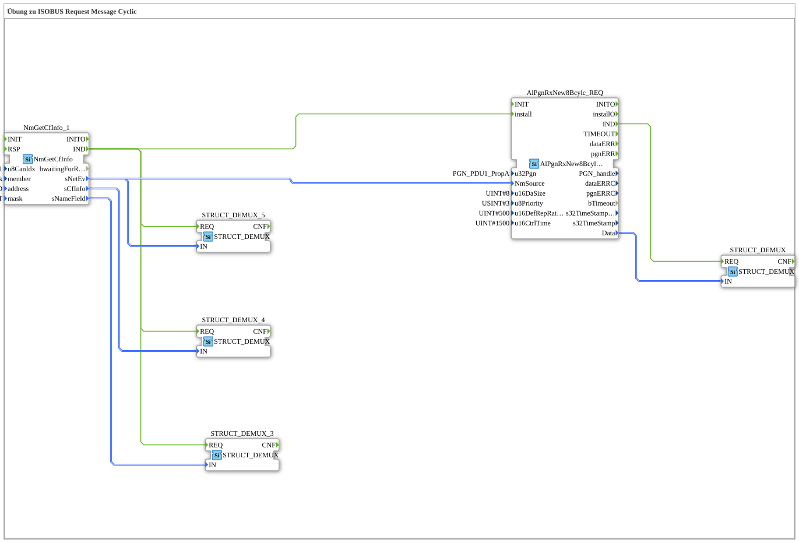

# Exercise_133: ISOBUS Request Message Cyclic Exercise

[(https://notebooklm.google.com/notebook/a6872e59-1dfc-4132-a118-aff1bc7bc944)
This article describes the logiBUS® exercise `Uebung_133`
----

## Overview

[cite_start]Combination of querying and cyclical monitoring using `AlPgnRxNew8Bcylc_REQ`[cite: 1].

This function block automatically sends requests to the partner at fixed intervals and simultaneously monitors the arrival of responses within the control time. This is the most secure form of communication for data that is not automatically sent by the partner but still needs to be constantly updated.

This function block automatically sends requests to the partner at fixed intervals and simultaneously monitors the arrival of the responses within the control time. This is the most secure form of communication for data that is not automatically sent by the partner but still needs to be constantly up-to-date.

[

[cite_start]
