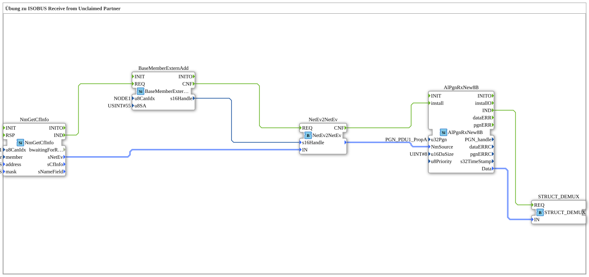

# Exercise_134: ISOBUS Receive from Unclaimed Partner

[(https://notebooklm.google.com/notebook/a6872e59-1dfc-4132-a118-aff1bc7bc944)
This article describes the logiBUS® exercise `Uebung_134`.
----
## Overview

[cite_start]This exercise demonstrates a solution for communicating with devices that do not perform standard-compliant ISOBUS address claiming [cite: 1].

Using the function block `BaseMemberExternAdd`, a communication handle for a fixed source address (here `u8SA = 55`) is manually created. This handle is used to receive messages from an "unclaimed partner" that does not disclose its identity via name management. This is often necessary when integrating simple sensors or legacy devices.

[cite_start] 
