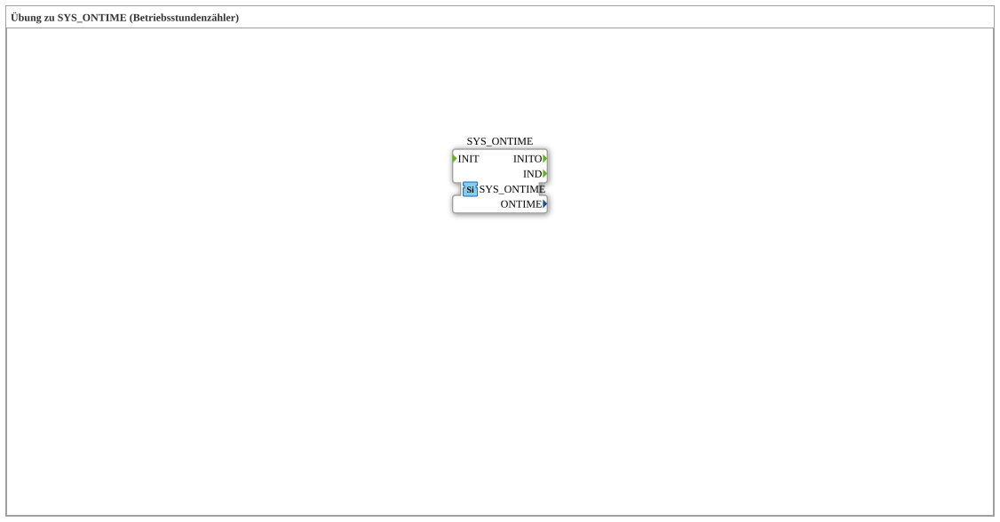

# Exercise_140: Exercise on SYS_ONTIME (Operating Hour Counter)

This article describes the logiBUS® exercise `Uebung_140`. It demonstrates how to record system runtime.
## 🎧 Podcast

* [From 1400 Errors to Clean Code: Migrating the "Grain Hoe" to Eclipse 4diac™ 3.0 and the Power of AX Adapters ](https://podcasters.spotify.com/pod/show/logibus/episodes/Von-1400-Fehlern-zum-sauberen-Code-Die-Migration-der-Getreidehacke-auf-Eclipse-4diac-3-0-und-die-Macht-der-AX-Adapter-e3ahcko)

----

## Objective of the Exercise

Using the function block `SYS_ONTIME`. The goal is to record the cumulative time the controller is powered on and active.

-----

## Description and Components

[cite_start]The subapplication `Uebung_140.SUB` uses a special measurement block for time monitoring[cite: 1].

### Function Blocks (FBs)
* **`SYS_ONTIME`**: Type `logiBUS::signalprocessing::measurement::SYS_ONTIME`. [cite_start]This block measures the time since the last system start or the cumulative total time (depending on the implementation)[cite: 1].

----

## Functionality

The block runs in the background. It typically provides outputs for seconds, minutes, and hours. This data can then be permanently stored (NVS) or displayed on the terminal's service menu.

-----

## Application Example

**Maintenance Intervals**:
The controller counts the machine's operating hours. Once a limit (e.g., 500 hours) is reached, the operator receives a message on the terminal: "Oil change required." This ensures adherence to maintenance schedules and extends the machine's lifespan.

---

### 🌐 Related topic subpages on ms-muc-docs.de
* [🌐 Eclipse 4diac IDE & Color Reference on ms-muc-docs.de](https://www.ms-muc-docs.de/iec-61499/eclipse-4diac/)
