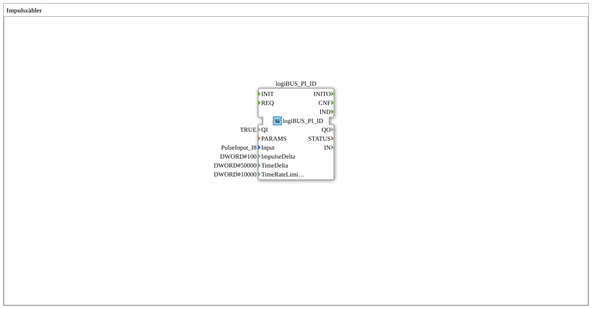

Here is the documentation for exercise `Uebung_150` based on the provided data.
# Exercise_150: Pulse Counter

* * * * * * * * * *
## Introduction

Exercise **Exercise_150** implements a sub-application (SubApp) that functions as a "pulse counter." It is used to configure and integrate a hardware-based pulse input via the logiBUS system. The goal is to establish an interface to a physical input (`PulseInput_I8`) and define parameters for data acquisition.

## Function Blocks Used

This SubApp uses a specific function block to configure communication with the hardware.

### Sub-modules: logiBUS_PI_ID

This module is the central component of the exercise and establishes the connection to the hardware input layer.

- **Type**: `logiBUS::io::PI::logiBUS_PI_ID`
- **Internal Function Blocks Used**:
- **Block Name**: `logiBUS_PI_ID`
- **Type**: `logiBUS::io::PI::logiBUS_PI_ID`
- **Parameters**:
- `QI` = `TRUE` (Block activation/initialization)
- `Input` = `PulseInput_I8` (Specific hardware input assignment)
- `ImpulseDelta` = `100` (Threshold for pulse changes)
- `TimeDelta` = `50000` (Time interval for update/measurement)
- **Event output/input**: *No explicit connections defined in the XML.*
- **Data output/input**: *No explicit connections defined in the XML.*
- **Functionality**:

The function block `logiBUS_PI_ID` initializes a pulse input channel. Setting `QI` to `TRUE` activates the function block. The parameter `Input` specifies that the physical input `PulseInput_I8` is used. The parameters `ImpulseDelta` and `TimeDelta` configure the sensitivity and timing behavior of the counter, which controls when and how often updates are sent or processed via the bus.

## Program Flow and Connections

Since this exercise involves only configuring a hardware driver within a sub-app, there is no complex program flow or interconnections between multiple function blocks.

- **Initialization**: The function block is statically parameterized. When the application starts, the hardware driver is loaded with the values `100` for the pulse delta and `50000` for the time delta.
- **Interfaces**: The sub-app `Uebung_150` itself does not define any external inputs or outputs in its `SubAppInterfaceList`. It acts as a self-contained configuration module for the logiBUS.
- **Learning Objectives**:
- Understanding how to connect hardware inputs via logiBUS.
- Configuring counter parameters (delta values).
- Working with SubApp types to encapsulate hardware configurations.

## Summary

Exercise **Exercise_150** presents a basic configuration for a pulse counter. It uses the block `logiBUS_PI_ID` to initialize the hardware input `PulseInput_I8` with specific parameters for pulse and time intervals. This exercise is essential for understanding the hardware abstraction layer in 4diac systems that use logiBUS.

---

### 🌐 Related topic subpages on ms-muc-docs.de

- [🌐 Eclipse 4diac IDE & color reference on ms-muc-docs.de ](https://www.ms-muc-docs.de/iec-61499/eclipse-4diac/)

]
