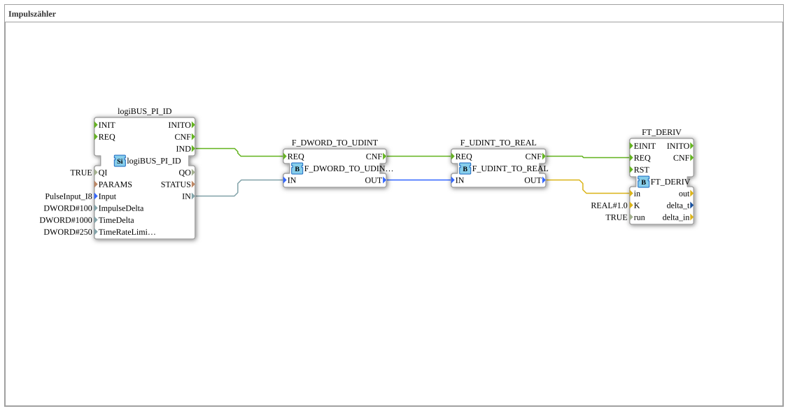

Here is the documentation for Exercise 151 based on the provided data.

# Exercise_151: Pulse Counter



*(Insert image of the exercise here, if available)*

* * * * * * * * * *

## Introduction
This exercise implements a sub-application (`SubAppType`) named **Exercise_151**. The goal of the exercise is to acquire and process pulse signals via a hardware interface. The incoming raw data is converted, and then the derivative (rate of change) is calculated using a mathematical function block. This is typically used to determine a speed or frequency from a counter reading.

## Function Blocks Used

This exercise uses various standard and library function blocks within the network.

### Sub-Building Blocks: Exercise_151 (Network Components)

This section describes the internal building blocks that are interconnected in the network of this sub-application.


``` - **Internal Function Blocks Used**:

- **logiBUS_PI_ID**: `logiBUS::io::PI::logiBUS_PI_ID`

- This function block provides the interface to the hardware (pulse input).

- **Parameters**:

- `QI` = `TRUE` (Activates the function block)

- `Input` = `PulseInput_I8` (Reference to the physical input)

- `ImpulseDelta` = `100`

- `TimeDelta` = `1000`

- **Functionality**: It provides process data based on the configured parameters for the pulse input.


- **F_DWORD_TO_UDINT**: `iec61131::conversion::F_DWORD_TO_UDINT`

- **Type**: Conversion block.

- **Function**: Converts the data type `DWORD` (double word) to `UDINT` (unsigned double integer). This is necessary to prepare the raw data of the hardware module for further mathematical processing.

- **F_UDINT_TO_REAL**: `iec61131::conversion::F_UDINT_TO_REAL`

- **Type**: Conversion block.

- **Function**: Converts the data type `UDINT` to `REAL` (floating-point number). The `REAL` representation is required for the subsequent derivative function block.

- **FT_DERIV**: `OSCAT::Basic::POUs::Engineering::Control::FT_DERIV`

- **Type**: Control engineering function block (derivative).

- **Parameters**:

- `K` = `1.0` (gain factor)

- `run` = `TRUE` (function block is active)

- **Functionality**: Calculates the time derivative of the input signal. In this context, the frequency or velocity is determined from the change in the counter value (pulses) over time.


## Program Flow and Connections

The exercise flow is defined by the event and data chain:

1. **Signal Acquisition**: The function block `logiBUS_PI_ID` acquires signals at input `PulseInput_I8`. As soon as new data is available, event `IND` is triggered, and the data value is made available at output `IN`.

2. **Type Conversion**:

* The signal first passes to function block `F_DWORD_TO_UDINT`.

* The result is forwarded to `F_UDINT_TO_REAL`.

* This chain ensures that the signal is converted from a raw binary format (`DWORD`) into a floating-point number (`REAL`).


* The signal is then converted to a floating-point number (`REAL`). 3. **Calculation**:

* The converted `REAL` value is passed to the `in` input of the `FT_DERIV` block.

* The `FT_DERIV` block calculates the change in the input signal per unit of time. Since the input is an accumulated counter value (pulses), the derivative corresponds to the current pulse frequency (pulses per second/minute, depending on the time base).

**Learning Objectives:**

* Integration of hardware inputs (LogiBUS).

* Handling data type conversions in IEC 61499 / IEC 61131.

* Application of mathematical functions from the OSCAT library for signal processing.

## Summary
Exercise **Exercise_151** demonstrates the construction of a pulse counter with subsequent frequency calculation. By combining hardware drivers, conversion logic and the differentiator (`FT_DERIV`), a usable process variable (e.g. speed or flow rate) is generated from simple counting pulses.