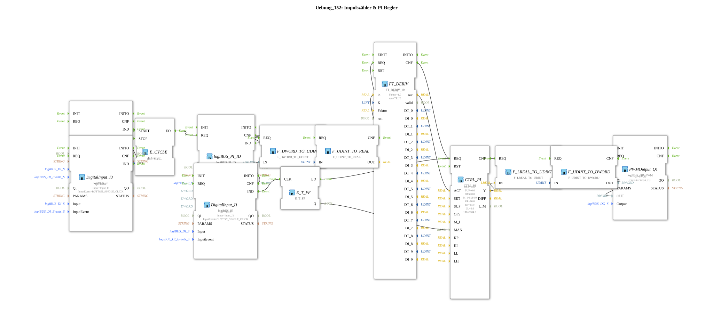

# Exercise_152: Pulse Counter & PI Controller

[](https://notebooklm.google.com/notebook/041f4df4-b729-484d-b786-b6dcdf151961)

This article describes the logiBUS® exercise `Uebung_152`. Here, a closed-loop control system is implemented.

----

## Objective of the Exercise

Implementation of a PI controller to maintain a constant physical quantity.

-----

## Description and Components

[cite_start]The subapplication `Uebung_152.SUB` connects sensors, control systems, and actuators[cite: 1].


### Control Loop Components



* **Sensor (Actual Value)**: Pulse counter `logiBUS_PI_ID` + derivative `FT_DERIV` (calculates, for example, the current speed).

* **Controller**: `CTRL_PI` (OSCAT). It compares the setpoint (`SET = 16.0`) with the actual value.

* **Actuator (Manipulated Variable)**: `logiBUS_QD_PWM`. A pulse-width modulated output that controls, for example, a motor or a valve.

* **Operation**: Pushbuttons `I2` (Start) and `I3` (Stop) control the cycle. Button `I1` switches between manual and automatic operation (`MAN` input on the controller).

-----

## Functionality

The controller continuously attempts to adjust the manipulated variable at the PWM output so that the measured pulse rate matches the setpoint.

* If the system is under load (speed decreases), the controller increases the PWM ratio.

* If the speed becomes too high, it reduces it.

-----

## Application Example

**Cruise control** or **Constant application rate**: Regardless of whether the tractor is driving uphill or downhill, the rotational speed of the seed drill should remain exactly the same.


* ---

### 🌐 Related topic subpages on ms-muc-docs.de

* [🌐 The PWM signal & infographic on ms-muc-docs.de](https://www.ms-muc-docs.de/automatisierung/das-pwm-signal-die-kunst-spannung-zu-zerhacken/das-pwm-signal-die-kunst-spannung-zu-zerhacken-website/)


```